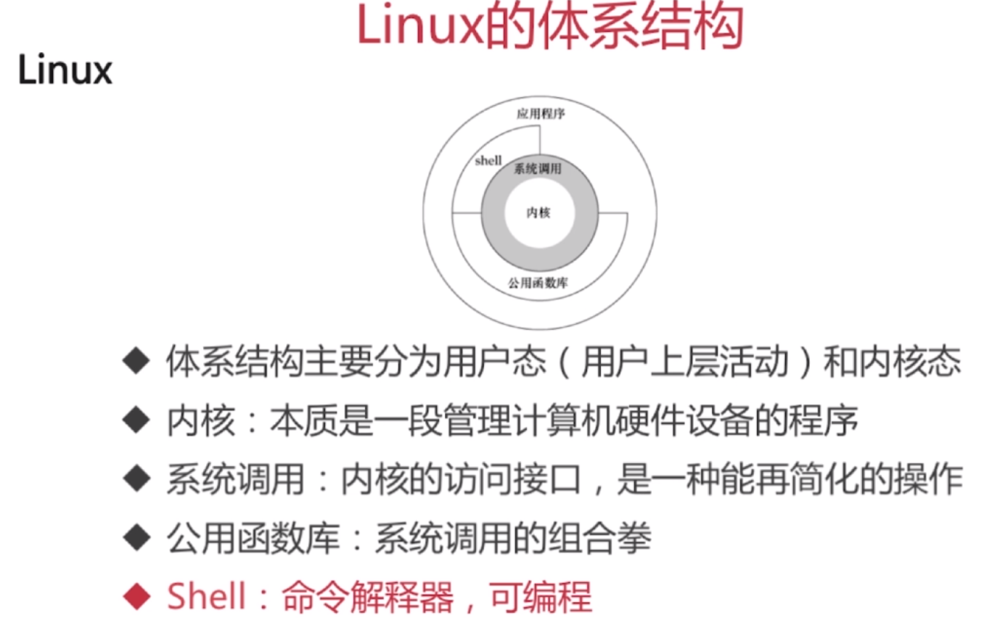
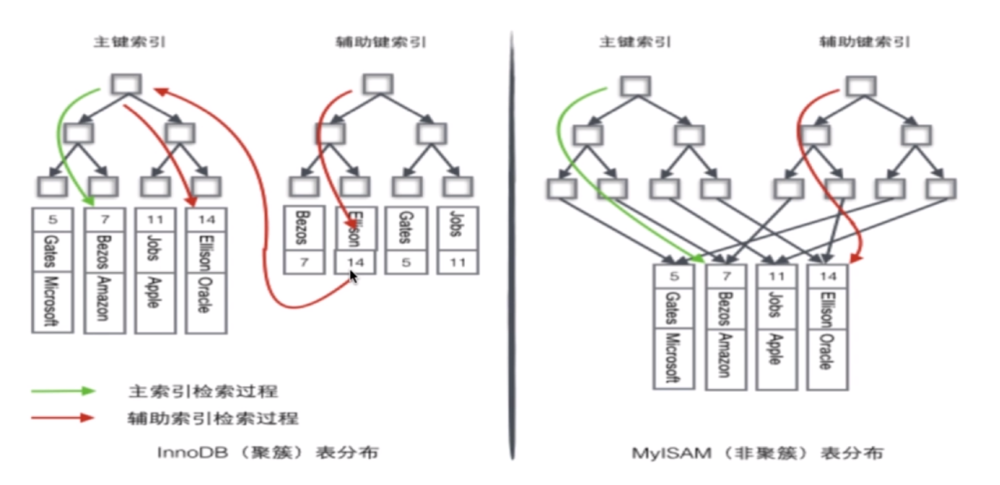

* [linux](#linux)
    * [linux的体系结构](#linux的体系结构)
    * [索引](#索引)
    * [锁模块](#锁模块)
    * [关键语法](#关键语法)
  
# linux
## linux的体系结构

 

## 索引
1. 为什么要使用索引：快速查询数据。
2. 什么样的信息能成为索引：主键，唯一键以及普通键等。
3. 索引的数据结构：二叉查找树，B树，B+树，Hash结构。
4. 二叉查找树：可能会形成一个线性的树，其效率很低，若使用平衡二叉查找树，则旋转的成本很高，只适用于插入和删除比较少，查找比较多的环境。
5. B树：
       
       1.定义任意非叶子结点最多只有M个儿子；且M>2；

       2.根结点的儿子数为[2, M]；

       3.除根结点以外的非叶子结点的儿子数为[M/2, M]；

       4.每个结点存放至少M/2-1（取上整）和至多M-1个关键字；（至少2个关键字）

       5.非叶子结点的关键字个数=指向儿子的指针个数-1；

       6.非叶子结点的关键字：K[1], K[2], …, K[M-1]；且K[i] < K[i+1]；

       7.非叶子结点的指针：P[1], P[2], …, P[M]；其中P[1]指向关键字小于K[1]的

       子树，P[M]指向关键字大于K[M-1]的子树，其它P[i]指向关键字属于(K[i-1], K[i])的子树；

       8.所有叶子结点位于同一层；
6. B+树:
        
       1.其定义基本与B-树同，除了：

       2.非叶子结点的子树指针与关键字个数相同；

       3.非叶子结点的子树指针P[i]，指向关键字值属于[K[i], K[i+1])的子树

       （B-树是开区间）；

       4.为所有叶子结点增加一个链指针；

       5.所有关键字都在叶子结点出现，数据只存放在叶子节点，所以查询结束于叶子节点；

7. B+树的优势：B+树的磁盘速写代价更低，查询效率更稳定，更有利于对数据库的扫描
8. Hash索引：缺点：仅仅满足=，in不能使用范围查询，无法被用来避免数据的排序操作，不能利用部分索引键查询，不能避免表扫描，遇到大量HASH值相等的情况后并一定效率高。
9. BITMAP：位图索引适合只有几个固定值的列，如性别、婚姻状况、行政区等等，而身份证号这种类型不适合用位图索引，另外位图索引适合静态数据，而不适合索引频繁更新的列，因为位图索引需要锁定行值。
10. 密集索引和稀疏索引的区别：密集索引文件中每个搜索码值都对应一个索引值，稀疏索引文件只为索引码的某些值建立索引项
11. InnoDB:若一个主键被定义，则主键为密集索引，若没有主键被定义，该表的第一个唯一非空索引作为密集索引，若不满足上述条件，innodb内部会生成一个隐藏主键作为索引，非主键缩影存储相关键位和其对应的主键值，包括两次查找：

 

12. 如何定位并优化慢查询sql: 

        1.根据慢日志定位慢查询sql
        2.使用explain等工具分析sql
        3.修改sql或者尽量让sql走索引

13. 联合索引的最左匹配原则：若a和b都为索引，当查询ab和a时会走这个索引,但是查询b时不会走这个索引，其中=和in可以乱序，但是遇见范围查询（>,<,between,like）就停止匹配。
14. 最左匹配原则的成因：mysql对先根据第一个索引进行排序，然后再根据第二个索引排序，所以只有第一个是绝对有序的，后边的不是相对有序的。
15. 索引是建立的越多越好么：

        1.数据量小的表不需要建立索引，建立会增加额外的索引开销
        2.数据变更需要维护索引，因此更多的索引意味着更多的维护成本 
        3.更多的索引意味着更多的存储空间
## 锁模块
1. myisam默认用表级锁，不支持行级锁，innodb默认用行级锁，支持表级锁
2. Myisam适用的场景：频繁执行全表count语句，对数据进行增删改的频率不高，主要执行查询，没有事务
3. Innodb适用的场景：数据增删改查都比较频繁，可靠性要求比较高，要求支持事务
4. 按锁的粒度划分：表级锁，行级锁，页级锁
5. 按锁级别划分：共享锁，排它锁
6. 按加锁方式划分：自动锁和显示锁
7. 按操作划分：DML锁，DDL锁
8. 按使用方式划分：乐观锁和悲观锁
9. 数据库事务的四大特性：原子性，一致性，隔离性，持久性
10. 事务并发访问引起的问题以及如何避免：

        1.更新丢失——mysql所有事务隔离级别在数据库层面上均可避免
        2.脏读——READ_COMMITTED事务隔离级别以上可以避免
        3.不可重复读——REPEATABLE_READ事务隔离级别以上可以避免
        4.幻读——SERIALIZABLE事务隔离级别可避免

