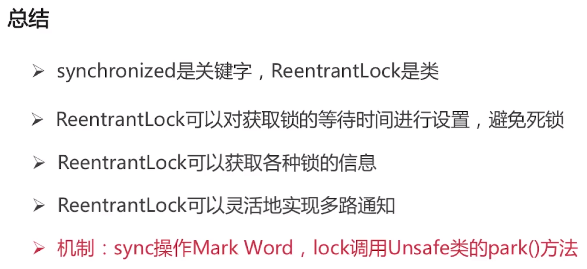

* [java多线程与并发](#java多线程与并发)
    * [进程和线程](#进程和线程)
    * [多线程原理](#多线程原理)

  
# java多线程与并发
## 

 

1. 进程是资源分配的最小单位，线程是cpu调度的最小单位：所有与进程相关的资源，都被记录在PCB（进程控制块）中，进程是抢占处理机的调度单位，线程属于某个进程，共享资源，线程只由堆栈寄存器，程序计数器和TCB线程控制块组成。
2. 线程不能看做独立应用，而进程可看做独立应用，进程有独立的地址空间，相互不影响，线程只是进程的不同执行路径，线程没有独立的地址空间，多进程的程序比多线程程序健壮，进程切换比线程切换开销大
3. java进程和线程的关系：java对操作系统提供的功能进行封装，包括进程和线程，运行一个程序会产生一个进程，进程包含至少一个线程。每个进程对应一个jvm实例，多个线程共享JVM里的堆，java采用单线程编程模型，程序会自动创建主线程，主线程可以创建子线程，原则上要后于子线程完成执行。
4. start和run的区别

 

5. Thread和Runnable是什么关系：Thread和Runnable接口的类，使得run支持多线程，因类的单一继承原则，推荐多使用Runnable接口
6. 如何给run()方法传参：构造函数传参，成员变量传参，回调函数传参
7. 如何实现处理线程的返回值：

        1.主线程等待法
        2.使用Thread类的join（）方法阻塞当前线程等待子线程处理完毕
        3.通过callable接口实现：通过FutureTask或者线程池获取
8. 线程的状态：
           
        1.新建（new）：创建后尚未启动的线程状态
        2.运行（runnable）：包含running和ready（存放在就绪队列中，只要获得CPU立马执行）
        3.无限期等待（waiting）:不会被分配CPU执行时间，需要显式被唤醒

 
        
        4.限期等待（timed waiting）：在一定时间后会由系统自动唤醒

 
        
        5.阻塞（blocked）:当一条正在执行的线程请求某一资源失败时，就会进入阻塞态；处于阻塞态的线程会不断请求资源，一旦请求成功，就会进入就绪队列，等待执行
        6.结束（terminiated）:已终止线程的状态，线程已经结束执行

9. sleep和wait的区别：

        1.sleep是Thread的方法，wait是object的方法
        2.sleep可以在任何地方使用
        3.wait方法只能在synchronized方法或synchronized块中使用
        4.sleep只会让出CPU，不会导致锁行为的改变
        5.wait不仅让出CPU,还会释放已经占有的同步资源锁
10. 锁池EntryList:假设线程A已经拥有了某个对象的锁，而其他线程B，C想要调用这个对象的某个synchronized方法，此时必须获得该对象的所有权，而这时锁被A占用着，此时B,C就会被阻塞，进入一个地方去等待锁的释放，这个地方便是该对象的锁池。
11. 等待池（WaitSet）：假设线程A调用了某个对象的wait()方法，线程A就会释放该对象的锁，同时线程A就进入到了该对象的等待池中，进入到等待池中的线程不会去竞争该对象的锁。
12. notifyAll和notify的区别：notifyAll会让所有处于等待池的线程全部进入锁池去竞争获取锁的机会，notify只会随机选取一个处于等待池中的线程进入锁池去竞争获取锁的机会。
13. yield函数：当调用Thread.yield函数时，会给线程调度器一个当前线程愿意让出CPU使用的暗示，但是线程调度器可能会忽略这个暗示。
14. 已经抛弃的方法：通过Stop方法来停止线程（直接停止线程，很不安全,可能导致数据的不一致），suspend和resume方法（非常容易发生死锁，A获得锁后被suspend,B需要获得锁才能resumeA，发生死锁）
15. 目前使用的方法：调用interrupt方法，通知线程应该中断了，如果线程处于被阻塞的状态，那么线程将立即退出被阻塞状态，并抛出一个interruptrdException异常，如果线程处于正常活动状态，那么会将该线程的中断标志设置为true，被设置中断标志的线程将继续正常运行，不受影响，需要被调用的线程配合中断，在正常运行任务时，经常检查本线程的中断标志位，如果被设置了中断标志就自行停止程序。
16. 

 

## 多线程原理
1. 线程安全的主要诱因：存在共享数据也称为临界数据，存在多条线程共同操作这些共享数据
2. 解决问题根本方法：同一时刻有且只有一个线程在操作共享数据，其他线程必须等到该线程处理完数据后再对共享数据进行操作。
3. 互斥锁的特性：

        互斥性：在同一时间只允许一个线程持有某个对象锁，通过这种特性来实现线程的协调机制，这样在同一时间只有一个线程对需要同步的代码块进行访问。互斥性也称为原子性。
        可见性：必须确保在锁被释放之前，对共享变量所做的修改，对于随后获得该锁的另一个线程是可见的，否则另一个线程可能是本地缓存的某个副本上继续操作，从而引起不一致。
        synchronized锁的不是代码是对象
4. 获取对象锁：

 

5. 获取类锁： 

 

6. 总结：

 
一个线程访问静态synchronized的时候，允许另一个线程访问对象的实例synchronized方法。反过来也是成立的，因为他们需要的锁是不同的，类锁和对象锁互不影响。

7. 实现synchronized的基础：java对象头，Monitor
8. 对象在内存中的布局：对象头，实例数据，对齐填充
9. 对象头结构：

 

 

10. monitor:每个java对象天生自带了一把看不见的锁，synchronized底层就是利用monitor来实现的,和synchronized的表现相同。
11. 什么是重入：从互斥锁的设计上来说，当一个线程再次请求自己持有对象锁的临界资源时，这种情况属于重入。
12. 为什么会对synchronized嗤之以鼻：早期版本中，synchronized属于重量级锁，依赖于mutex lock来实现，线程之间的切换需要从用户态转换到和心态，开销较大
13. java6以后，synchronized性能得到了很大的提升：

        自旋锁：许多情况下，共享数据的锁定改状态持续时间较短，切换线程不值得，通过让线程执行循环等待锁的释放，不让出CPU，若锁被占用的时间过长，会带来许多性能上的开销。
        自适应自旋锁：自旋的次数不在固定，由前一次在同一个锁上的自旋时间及锁的拥有者的状态来决定
        锁消除：JIT编译时，对运行上下文进行扫描，去除不必要的锁
        锁粗化：另一种极端，通过扩大加锁的范围，避免反复加锁和解锁
14. synchronized的四种状态及膨胀方向：无锁->偏向锁->轻量级锁->重量级锁
15. 偏向锁：减少统一线程获取锁的代价,大多数情况下，锁不存在多线程竞争，总是由同一线程多次获得，核心思想：如果一个线程获得了锁，那么锁就进入了偏向模式，此时mark word的结构也变为偏向锁结构，当线程再次请求锁时，无需再做任何同步操作，即获取锁的过程只需要检查,mark word的锁标记位为偏向锁以及当前线程ID等于Mark word的thread id即可，这样就省去了大量有关锁申请的操作。不适用与锁竞争比较激烈的多线程场合。
16. 轻量级锁：轻量级锁是由偏向锁升级来的，偏向锁运行在一个线程进入同步块的情况下，当第二个线程加入锁争用的时候，偏向锁就会升级为轻量级锁。适用于线程交替执行的同步块，若存在同一时间访问同一锁的情况，就会导致轻量级锁膨胀为重量级锁。
17. 锁的内存语义：当线程释放时，java内存模型会把该线程对应的本地内存中的共享变量刷新到主存中，而当线程获取锁时，java内存模型会把该线程对应的本地内存置为无效，从而使得被监视器保护的临界区代码必须从主内存中读取共享变量。

 

18. ReentranLock(再入锁)：位于java.util.concurrent.locks包，和CountDownLatch,FutureTask,Semaphore一样基于AQS实现，能够实现比synchronized更细粒度的控制，如控制公平性，减少线程饥饿,调用lock()之后，必须调用unlock()释放锁，性能未必比synchronized高，并且也是可重入的。
19. ReentrantLock公平性设置：ReentrantLock fairlock=new ReentrantLock(true);,参数为true时，倾向于将锁富裕等待时间最久的线程，公平锁，获取锁的顺序按先后调用lock方法的顺序，类似于队列的形式（慎用），非公平锁，抢占的顺序不一定，看运气，synchronized是非公平锁。
20. ReentrantLock将锁对象化：判断是否有线程，或者某个特定线程，在排队等待获取锁，带超时的获取锁的尝试，感知有没有成功获取锁。

 

21. java内存模型JMM：java内存模型本身是一种抽象的概念，并不真实存在，它描述的是一组规则或规范，通过这组规范定义了程序中各个变量（包括实例字段，静态字段和构成数组对象的元素）的访问方式。

 

22. JMM中的主内存：存储java实例对象，包括成员变量，类信息，常量，静态变量等，属于数据共享的区域，多线程并发操作时会引发线程安全问题。
23. JMM的工作内存：存储当前方法的所有本地变量信息，本地变量对其他线程不可见，字节码行号指示器，native方法信息，属于线程私有数据区域，不存在线程安全问题
24. JMM与java内存区域划分是不同的概念层次：JMM描述的十一组规则，围绕原子性，有序性，可见性展开。相似点是存在共享区域和私有区域。

 

25. 指令重排序需要满足的条件：在单线程环境下不能改变程序运行的结果，存在数据依赖关系的不允许重排序，无法通过happens-before原则推导出来的，才能进行指令的重排序。（如果A操作的结果需要对B操作可见，则A与B存在happens-before关系）
26. happens-before的八大原则：

 
如果两个操作不满足上述任一个，那么这两个操作就没有顺序的保障,JVM可以对着两个操作进行重排序；如果操作A happens-before操作B，那么操作A在内存上所做的操作对操作B都是可见的。

27. volatile:JVM挺的轻量级同步机制，保证volatile修饰的共享变量对所有线程总是可见的，禁止指令的重排序优化，对volatile变量的读写都是直接从共享内存中读写，另外，进行volatile写操作时，不仅会将volatile变量写入共享内存，系统还会将当前线程专属空间中的所有共享变量写入共享内存。
进行volatile读操作时，系统也会一次性将共享内存中所有共享变量读入线程专属空间(但是volatile不能保证数据的原子性，原子性需要cas来保证)。
        
        1.当第二个操作是voaltile写时，无论第一个操作是什么，都不能进行重排序
        2.当地一个操作是volatile读时，不管第二个操作是什么，都不能进行重排序
        3.当第一个操作是volatile写时，第二个操作是volatile读时，不能进行重排序
28. CAS：一种高效的实现线程安全性的方法，支持原子更新操作，适用于计数器，序列发生器等场景，属于乐观锁，号称lock-free,CAS操作失败时由开发者决定是继续尝试，还是执行别的操作，将内存位置的内容与给定值进行比较，只有在相同的情况下，将该内存位置的内容修改为新的给定值。 这是作为单个原子操作完成的。 原子性保证新值基于最新信息计算; 如果该值在同一时间被另一个线程更新，则写入将失败。
29. CAS思想：包含三个操作数，内存位置，预期原值和新值。
30. CAS多数情况下对开发者来说是透明的：J.U.C的atomic包提供了常用的原子性数据类型以及引用，数组等相关原子类型和更新操作工具，是很多线程安全程序的首选。unsafe类虽提供CAS服务，但因能够操纵任意内存地址读写而有隐患，java9以后，可以使用variable handle API来替代unsafe。
31. 缺点：若循环时间长，则开销很大，只能保证一个共享变量的原子操作，ABA问题（解决：AtomicStampedReference）
32. 利用excutors创建不同的线程池满足不同场景的需要：

 

33. fork/join框架：把大任务分割成若干个小任务并行执行，最终汇总每个小任务结果后得到大任务结果的框架。
34. work-stealing算法：当某个线程没有任务执行的时候会从其他队列里窃取任务来执行。
35. 为什么使用线程池：降低资源消耗，提高线程的可管理性。
36. J.U.C的三个excutor接口：
        
        Excutor:运行新任务的简单接口，将任务提交和任务执行细节解耦
        ExcutorService:具备管理执行器和任务声明周期的方法，提交任务机制更完善。
        ScheduledExcutorService:支持Future和定期执行任务。
37. ThreadPoolExcutor:

 

38. ThreadPoolExcutor的构造函数：

        corePoolSize：核心线程数量
        maximunPoolSize：线程不够用时能够创建的最大线程数
        workQueue：任务等待队列
        keepAliveTime:抢占的顺序不一定，看运气
        threadFactory:创建新线程，Executors.defaultThreadFactory()

39. RejectExcutorHandler:线程池的饱和策略(提交任务的时候可能被拒绝)

        abortPolicy:直接抛出异常，这是默认策略
        callerRunsPolicy:用调用者所在的线程来执行任务
        discardsOldestPolicy：丢弃队列中靠最前的任务，并执行当前任务
        discardPolicy:直接丢弃任务
        实现RejectedExecutionHandler接口的自定义handler

 

 

40. 线程池的状态：

 

 

 

41. 线程池的大小如何选定：

        CPU密集型：线程数=核数+1
        I/O密集型：线程数=CPU核数*（1+平均等待时间/平均工作时间）一般为*2

42. 闭锁CountDownLatch：若有多条线程，其中一条线程需要等到其他所有线程准备完所需的资源后才能运行，这样的情况可以使用闭锁，首先初始化一个count，当一个线程执行完后，对count减1，当count为0时，才能执行那条线程。
43. 同步屏障：CyclicBarrier：若有多条线程，他们到达屏障时将会被阻塞，只有当所有线程都到达屏障时才能打开屏障，所有线程同时执行，若有这样的需求可以使用同步屏障。此外，当屏障打开的同时还能指定执行的任务。
44. 信号量：Semaphore：若有m个资源，但有n条线程（n>m），因此同一时刻只能允许m条线程访问资源，此时可以使用Semaphore控制访问该资源的线程数量。
45. 线程池的作用：

        1.减少资源的开销:减少了每次创建线程、销毁线程的开销。

        2.提高响应速度:每次请求到来时，由于线程的创建已经完成，故可以直接执行任务，因此提高了响应速度。

        3.提高线程的可管理性:线程是一种稀缺资源，若不加以限制，不仅会占用大量资源，而且会影响系统的稳定性。 
因此，线程池可以对线程的创建与停止、线程数量等等因素加以控制，使得线程在一种可控的范围内运行，不仅能保证系统稳定运行，而且方便性能调优。

        

