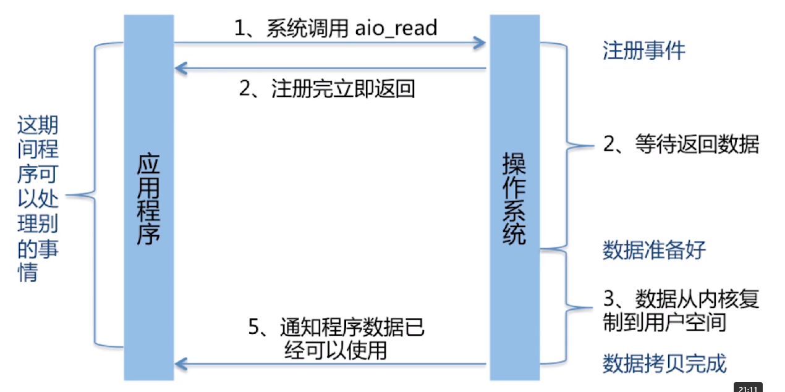

* [java常用类](#java常用类)
    * [java异常体系](#java异常体系)
    * [java集合框架](#java集合框架)
    * [java的I/O](#java的I/O)

  
# java多线程与并发
## java异常体系
1. Error和Exception的区别：

 

    Error:程序无法处理的系统错误，编译器不做检查
    Exception:程序可以处理的异常，捕获后可能恢复
    总结:前者是程序无法处理的错误，后者是可以处理的异常
2. RuntimeException：不可预知的，程序应当自行避免，非RuntimeException：可预知的，从编译器校验的异常
3. 常见Error以及Exception：

       NullPointerException:空指针引用异常
       ClassCastException:类型强制转换异常
       IllegalArgumentException：传递非法参数异常
       IndexOutOfBoundsException：下界越界异常
       NumberFormatException：数字格式异常

       非RuntimeException：
       ClassNotFoundException：找不到指定class异常
       IOException：IO操作异常

       Error：
       NoClassDefFoundError:找不到class定义的异常
       StackOverflowError：深递归导致栈被好进而爆出异常
       OutOfMemoryError：内存溢出异常
4. java的异常处理机制：抛出异常：创建异常对象，交由运行时系统处理，捕获异常：寻找合适的异常处理器处理异常，否则终止运行
5. java异常的处理原则：

       具体明确：抛出的异常应能通过异常类名和message准确说明异常的类型和产生异常的愿意
       提早抛出：应尽早的发现并抛出一厂房，便于精确定位问题
       延迟捕获：异常的捕获和处理应尽可能延迟，让掌握更多信息的作用域来处理异常
6. java异常处理消耗性能的地方：try-catch块影响JVM的优化，异常对象实例需要保存栈快照等信息，开销较大
## java集合框架

 

1. 集合List和Set

 

2. comparable的equals和hashcode和compareto方法
3. Hashmap put方法逻辑：

        如果HashMap未被初始化，则初始化
        对KEY求Hash值，然后再计算下标
        如果没有碰撞，直接放入桶中
        如果碰撞了，以链表的方式放入连接到后面
        如果链表长度超过阈值，就把链表转成红黑树
        如果链表长度低于阈值，就把红黑树转成链表
        如果节点已经存在就替换旧值
        如果桶满了(容量16*加载因子0.75)，就需要resize（扩容两倍后重排）
4. Hashmap:如何有效减少碰撞

        扰动函数：促使元素位置分布均匀，减少碰撞几率
        使用final对象，并采用合适的equals（）和hashcode（）方法

 

5. Hashmap扩容的问题：

        多线程环境下，调整大小会存在条件竞争，容易造成死锁
        rehashing是一个比较耗时的过程
6. HashTable:

        早期Java类库提供的哈希表的实现
        线程安全：设计到修改Hashtable的方法，使用synchronized修饰
7. 如何优化Hashtable:

        通过锁粒度细化，将整锁拆解成多个锁进行优化（早期通分段锁segment）
        当前的ConcurrentHashmap:CAS+synchronized使锁更细化
8. concurrentHashMap:put方法的逻辑

        判断node数组是否初始化，没有则进行初始化操作
        通过hash定位数组的索引坐标，是否有node节点吗，如果没有则使用CAS进行添加（链表的头节点），添加失败则进入下次循环
        检查到内部正在扩容，就帮助它一块扩容
        如果f!=null,就是用synchronized锁住f元素（链表或红黑树的头结点），如果是Node则进行链表的添加操作，如果是树就进行树的添加操作
        判断链表长度已经达到临界值，当节点数超过这个值就需要把链表替换为树

9. concurrentHashMap总结：

        比起segment锁拆的更细
        手下能使用无锁操作CAS拆入头结点，失败则循环重试
        若节点已经存在，则尝试获取头结点的同步锁，在进行操作

10. hashmap,hashtable,concurrenthashmap三者的区别：

 

11. 并发工具类：闭锁countdownlatch，栅栏cyclicbarrier,信号量semaphore,交换器exchanger
12. countdownlatch:

 

13. cyclicbarrier:

 

14. semaphore：

 

15. exchanger:

 

16. blockingQueue:主要用于生产者-消费者模式，在多线程场景时生产者线程在队列尾部添加元素，而消费者线程在队列头部消费元素，通过这种方式能够将任务的生产和消费进行隔离的目的。

 

 

##java的I/O
1. Block-IO:InputStream和OutputStream，Reader和Writer

 

2. NonBlack-IO:构建多路复用的，同步非阻塞的IO操作

 

3. Asynchronous IO:基于事件和回调机制

 
 

