* [JVM](#JVM)
    * [平台无关性](#平台无关性)
    * [反射](#反射)
    * [内存模型](#内存模型)
    * [java垃圾回收](#java垃圾回收)
    * [class文件的机构](#class文件的机构)
  
# JVM

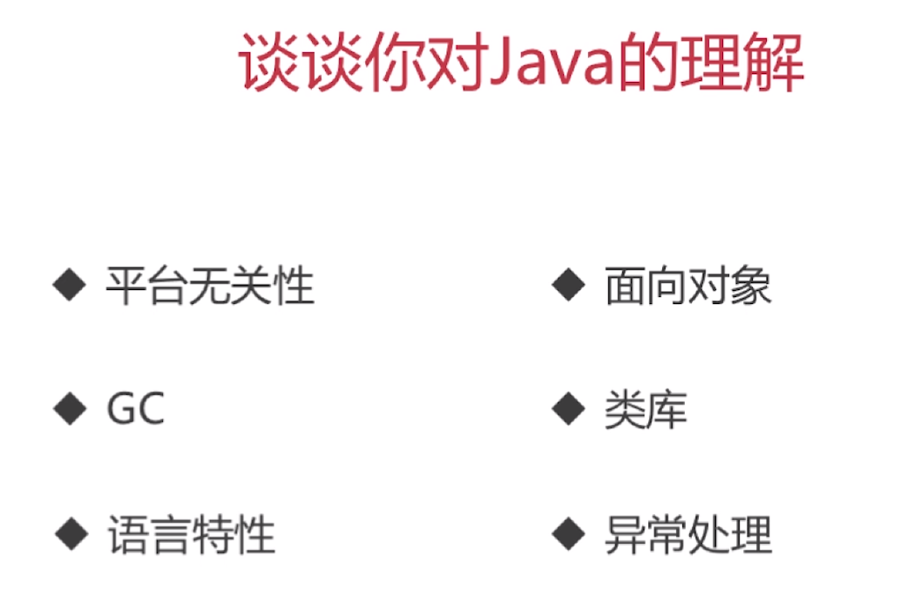

 

## 平台无关性

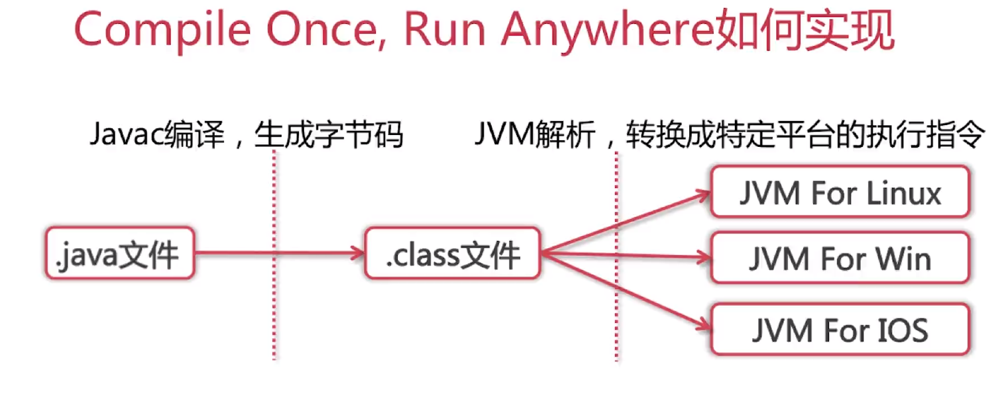

 

1. 为什么JVM不直接将源码解析成机器码去执行：
        
         1.准备工作：每次执行需要各种检查（语法，句法等）
         2.兼容性：也可以将别的语言解析成字节码

2. JVM如何加载.class文件:

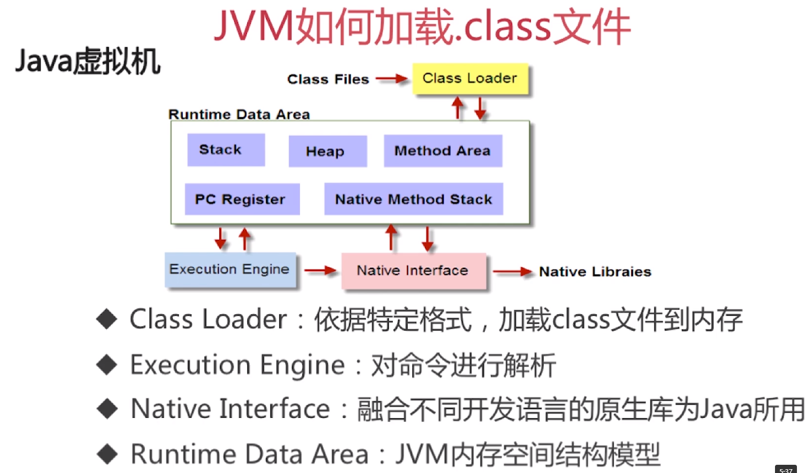

 

## 反射
1. 反射：java反射机制是在运行状态中，对于任意一个类，都能够知道这个类的所有属性和方法，对于任意一个对象，都能够调用它的任意方法和属性，这种动态获取信息以及动态调用对象方法的功能成为java语言的反射机制。[代码实现](https://github.com/joeyleee/Notes/tree/master/code/javabasic/src/reflrct)
2. 类从编译到执行的过程：编译器将.java源文件编译为.class字节码文件，classloader将字节码转换为JVM中的Class<>对象，JVM利用Class<>对象实例化。
3. ClassLoader：ClassLoader在java中有着非常重要的作用，它主要工作在class装载的加载阶段，其主要作用是从系统外部获得class二进制数据流。它是java的核心组件，所有的class都是由classloader进行加载的，classloader负责通过将class文件里的二进制数据流装载进系统，然后交给java虚拟机进行连接，初始化等操作。
4. classloader的种类：

        1. BootStrapClassLoader：C++编写，加载核心库java.*
        2. ExtClassLoader:java编写，加载扩展库javax.*
        3. AppclassLoader:java编写，加载程序所在目录
        4. 自定义classloader：java编写，定制化加载
5. 自定义ClassLoader的实现：

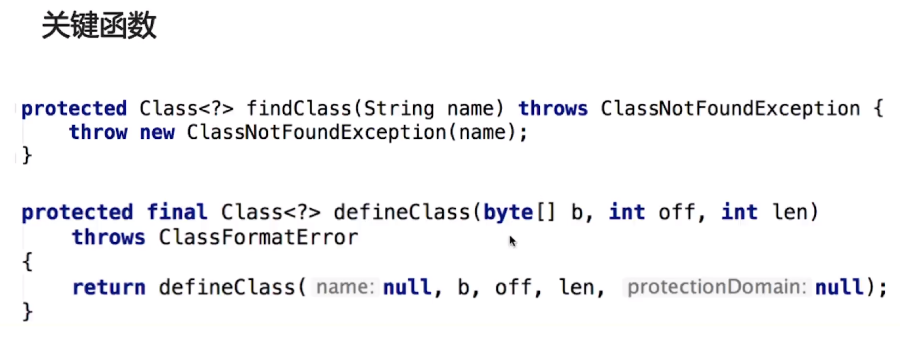

 

[代码实现](https://github.com/joeyleee/Notes/tree/master/code/javabasic/src/reflect)

6. 类加载器的双亲委派机制：

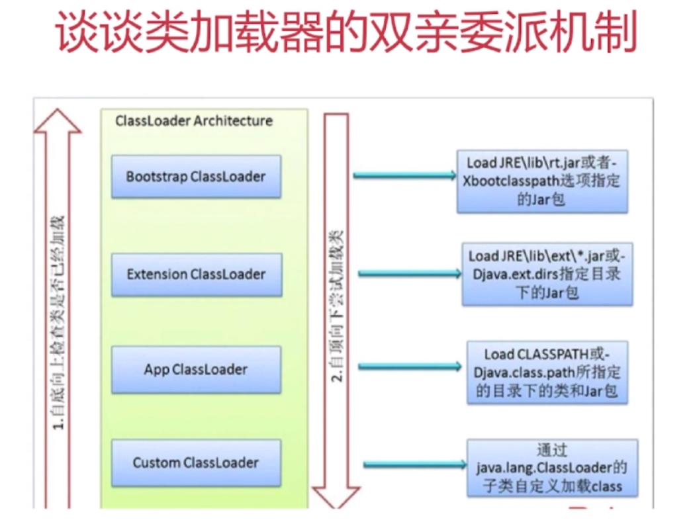

 

7. 为什么使用双亲委派机制去加载类：避免多份同样字节码的加载。
8. 类的加载方式：
        1.隐式加载：new
        2.显示加载：loadClass,forName
9. loadClass和forName的区别：类的加载过程

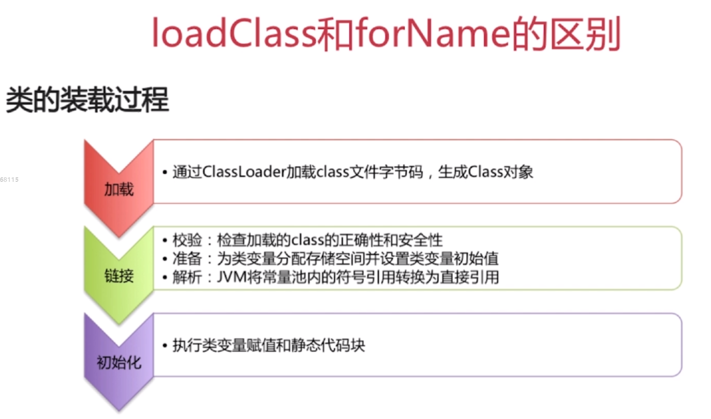

 

forName()得到的class是已经初始化完成的，loadClass得到的class是还没有连接的

10. 类的生命周期：加载——>验证——>准备——>解析——>初始化——>使用——>卸载；在类加载的过程中，以下3个过程称为连接： 验证——>准备——>解析
11. 接口和类都需要初始化，接口和类的初始化过程基本一样，不同点在于：类初始化时，如果发现父类尚未被初始化，则先要初始化父类，然后再初始化自己；但接口初始化时，并不要求父接口已经全部初始化，只有程序在运行过程中用到当父接口中的东西时才初始化父接口
12. 类加载过程中初始化开始的时机：
- 通过new创建对象；读取、设置一个类的静态成员变量(不包括final修饰的静态变量)；调用一个类的静态成员函数
- 使用java.lang.reflect进行反射调用的时候，如果类没有初始化，那就需要初始化
- 当初始化一个类的时候，若其父类尚未初始化，那就先要让其父类初始化，然后再初始化本类
- 当虚拟机启动时，虚拟机会首先初始化带有main方法的类，即主类

## 内存模型
1. 内存简介：

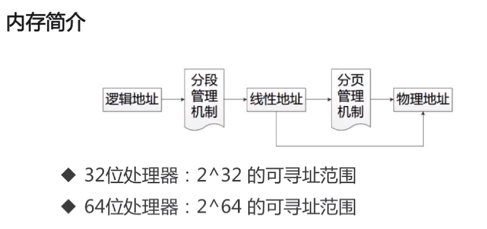

 

2. 地址空间划分：
        
        1.内核空间：操作系统使用的，32位 1GB
        2.用户空间：程序使用的，32位 3GB

3. JVM内存模型：

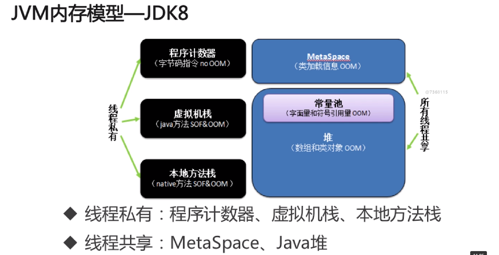

 

4. （线程私有）程序计数器：当前线程执行的字节码行号指示器（逻辑），改变计数器的值来选取吓一跳需要执行的字节码指令，和线程是一对一的关系即线程私有，对java方法计数，如果是native方法则计数器值为undifined,不会发生内存泄露;字节码解释器通过改变程序计数器来依次读取指令，从而实现代码的流程控制，如：顺序执行、选择、循环、异常处理。
在多线程的情况下，程序计数器用于记录当前线程执行的位置，从而当线程被切换回来的时候能够知道该线程上次运行到哪儿了
5. （线程私有）java虚拟机栈：

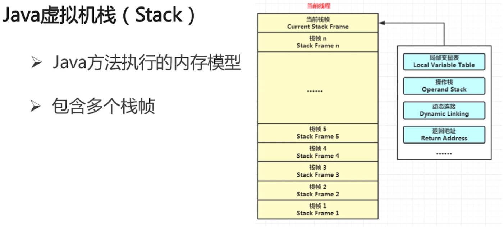

 

6. 局部变量表：包含方法执行过程中的所有变量
7. 操作数栈：入栈，出栈，复制，交换，产生消费变量

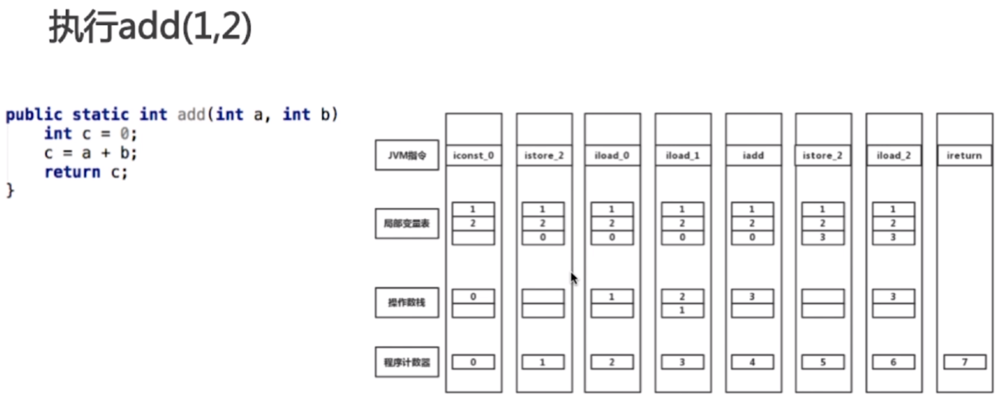

 

8. 递归为什么会引起java.lang.stackOverflowError异常:递归过深，栈帧数超出虚拟机栈深度
9. 虚拟机栈过多会引发java.lang.outOfMememoryError:

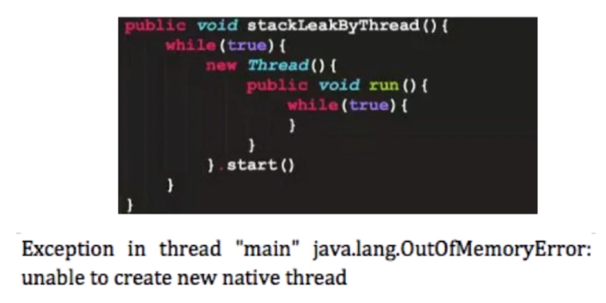

 

10. （线程私有）本地方法栈：与虚拟机栈相似，主要作用于标注了native的方法
11. 元空间与永久代的区别：元空间使用本地内存，而永久代使用JVM内存，java.lang.OutOfMemoryError:pernGen space不再存在
12. metaSpace相比PermGen的优势：字符串常量池存在于永久代中，容易出现性能问题和内存溢出，类和方法的信息大小难以确定，给永久代的大小指定带来困难，永久代会为GC带来不必要的复杂度，方便hotspot与其他jvm如jrockit的集成。
13. java堆（在虚拟机启动时创建）：

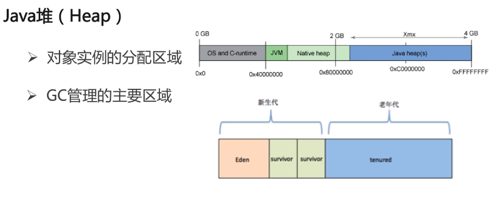

 

14. jvm三大性能调优参数：

        1.-Xss:规定了每个线程虚拟机栈（堆栈）的大小（一般256k足够）
        2.-Xms:堆的初始值
        3.-Xmx:堆能达到的最大值
15. java内存模型中堆和栈的区别——内存分配策略
        
        1.静态存储：编译时确定每个数据目标在运行时的存储空间要求
        2.栈式存储：数据区需求在编译时未知，运行时模块入口前确定
        3.堆式存储：编译时或运行时模块入口都无法确定，动态分配
16. java内存模型中堆和栈的区别：
        
        1.管理方式：栈自动释放，堆需要GC
        2.空间大小：栈比堆小
        3.碎片相关：栈产生的碎片远小于堆
        4.分配方式：栈支持静态和动态分配，而堆仅支持动态分配
        5.效率：栈的效率比堆高
        6.联系：引用对象，数组时，栈里定义变量保存堆中目标的首地址
17. 元空间，堆，线程独占部分间的联系——内存角度：

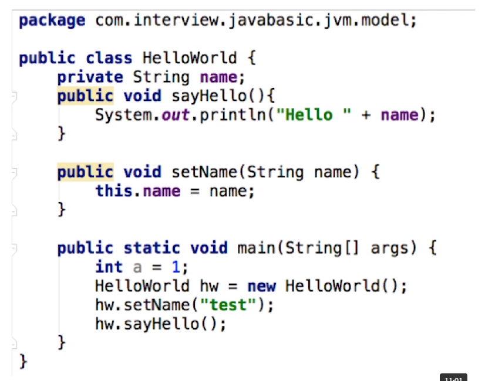

 

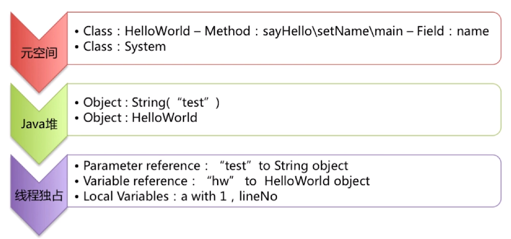

 

18. 不同jdk版本之间的intern()方法的区别-JDK6 和JDK6+：
        
        6:当调用intern方法时，如果字符串常量池先前已经创建了该字符串的对象，则返回池中的该字符串的引用。否则，将此字符串对象添加到字符串常量池中，并且返回该字符串对象的引用。
        6+：当调用intern方法时，如果字符串常量池先前已创建出该字符串对象，则返回池中该字符串的引用。否则，如果该字符串对象已经存在于java堆中，则将堆中对此对象的引用添加到字符串常量池中，并且返回该引用，如果堆中不存在，则在池中创建该字符串并返回其引用。
19. 对象的创建过程：当虚拟机遇到一条含有new的指令时，会进行一系列对象创建的操作：

- 检查常量池中是否有即将要创建的这个对象所属的类的符号引用；
若常量池中没有这个类的符号引用，说明这个类还没有被定义！抛出ClassNotFoundException；
若常量池中有这个类的符号引用，则进行下一步工作；
- 进而检查这个符号引用所代表的类是否已经被JVM加载；
若该类还没有被加载，就找该类的class文件，并加载进方法区；
若该类已经被JVM加载，则准备为对象分配内存；
- 根据方法区中该类的信息确定该类所需的内存大小； 
一个对象所需的内存大小是在这个对象所属类被定义完就能确定的！且一个类所生产的所有对象的内存大小是一样的！JVM在一个类被加载进方法区的时候就知道该类生产的每一个对象所需要的内存大小。

- 从堆中划分一块对应大小的内存空间给新的对象； 
分配堆中内存有两种方式：

        指针碰撞：
        如果JVM的垃圾收集器采用复制算法或标记-整理算法，那么堆中空闲内存是完整的区域，并且空闲内存和已使用内存之间由一个指针标记。那么当为一个对象分配内存时，只需移动指针即可。因此，这种在完整空闲区域上通过移动指针来分配内存的方式就叫做“指针碰撞”。
        空闲列表： 
        如果JVM的垃圾收集器采用标记-清除算法，那么堆中空闲区域和已使用区域交错，因此需要用一张“空闲列表”来记录堆中哪些区域是空闲区域，从而在创建对象的时候根据这张“空闲列表”找到空闲区域，并分配内存。 
        综上所述：JVM究竟采用哪种内存分配方法，取决于它使用了何种垃圾收集器。
- 为对象中的成员变量赋上初始值(默认初始化)；

- 设置对象头中的信息；

- 调用对象的构造函数进行初始化 
- 此时，整个对象的创建过程就完成了。
20. 对象的内存模型：一个对象从逻辑角度看，它由成员变量和成员函数构成，从物理角度来看，对象是存储在堆中的一串二进制数，这串二进制数的组织结构如下：
- 对象头：对象头中记录了对象在运行过程中所需要使用的一些数据：哈希码、GC分代年龄、锁状态标志、线程持有的锁、偏向线程ID、偏向时间戳等。
此外，对象头中可能还包含类型指针。通过该指针能确定这个对象所属哪个类。
此外，如果对象是一个数组，那么对象头中还要包含数组长度
- 实例数据：实力数据部分就是成员变量的值，其中包含父类的成员变量和本类的成员变量。
- 对齐补充：虚拟机要求对象的总长度为8字节的整数倍，但是实例数据部分的长度任意，对其补充用来占位。

## java垃圾回收
1. 对象被判定为垃圾的标准：没有被其他对象引用
2. 判定对象是否为垃圾的算法：
        
        1.引用计数算法：通过判断对象的引用数量来决定对象是否可以被回收，每个对象实例都有一个引用计数器，被引用则+1，完成引用则-1，任何引用计数为0的对象实例可以被当做垃圾收集，优点：执行效率高，程序执行受影响较小，缺点：无法检测出循环引用的情况，导致内存泄漏。
        2.可达性分析算法：

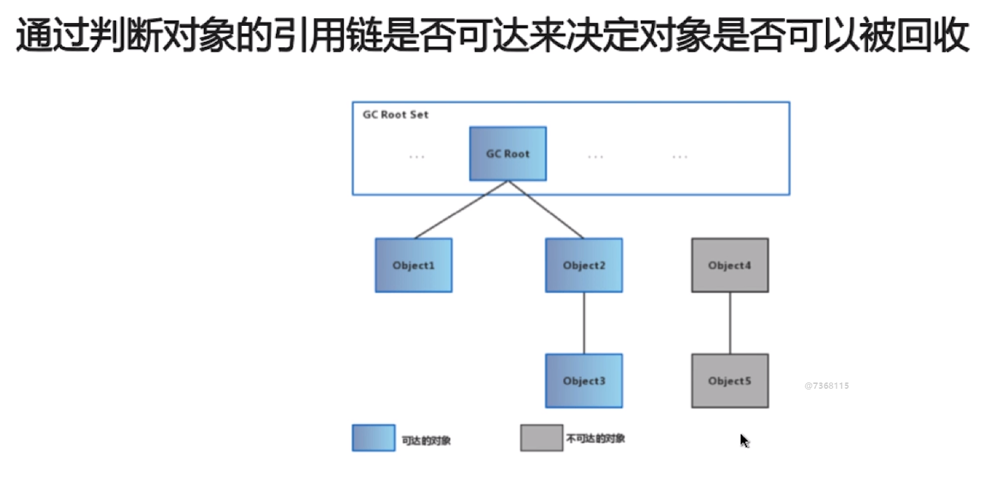

 

3. 可以作为GC root的对象：
        
        1.虚拟机栈中引用的对象（栈帧中的本地变量表）
        2.方法区中的常量引用的对象
        3.方法区中的类静态属性引用的对象
        4.本地方法栈中jni（native方法）的引用对象
        
4. 标记——清除算法：

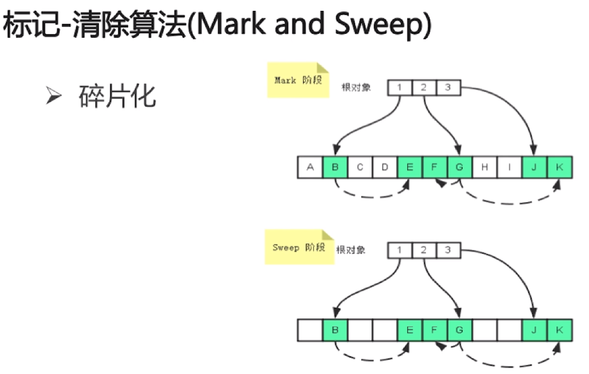

 

5. 复制算法：

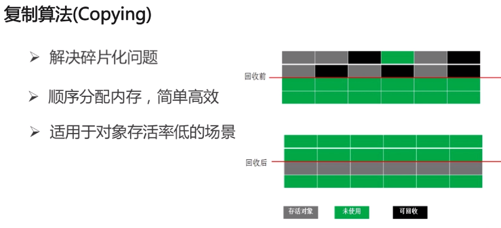

 

6. 标记——整理算法：

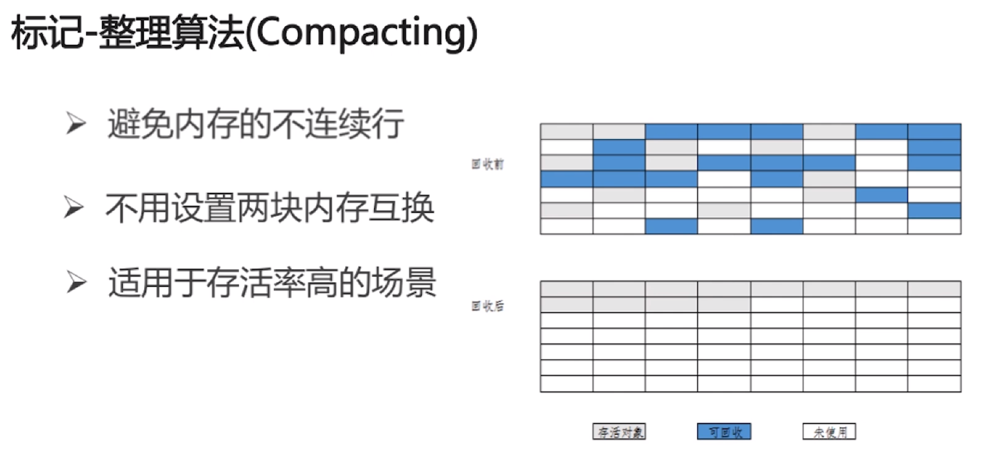

 

7. 分代收集算法：

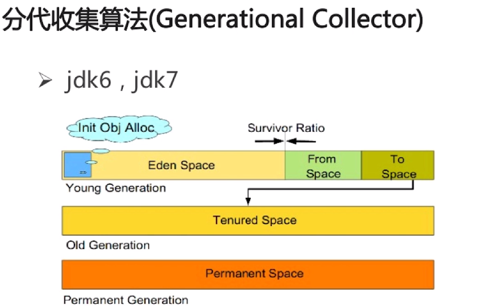

 

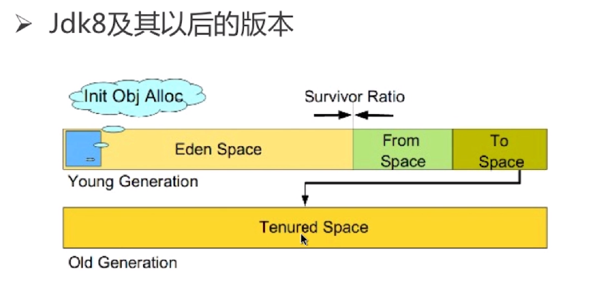

 

8. 年轻代：尽可能快速地收集掉那些生命周期短的对象

 

9. 对象如何晋升到老年代：经历一定minor次数依然存活的对象，达到MaxTenuringThreshold设置的年龄，默认15岁，survivor区中存放不下的对象，新生成的大对象（PretenuserSizeThreshold）
10. 常用调优参数：

        1.-XX:SurvivorRation:Eden和Survivor的比值默认为8:1
        2.-XX:NewRatio:老年代和年轻代内存大小的比例
        3.-XX:MaxTenuringThreshold:对象从年轻代晋升到老年代经过GC次数的最大阈值
        4.-XX:PretrnureSizeThreshold该参数用于设置大小超过该参数的对象被认为是“大对象”，直接进入老年代

11. 老年代：存放生命周期较长的对象采用标记——清理或者标记——整理算法。
12. 触发Full GC的条件：老年代空间不足，永久代空间不足，CMS GC时出现promotion failed,concurrent mode failure,Minor Gc晋升到老年代的平均大小大于老年代的剩余空间，调用System.gc()，使用RMI来进行RPC或管理的JDK应用，每小时执行一次FULL GC
13. stop-the-world：jvm由于要执行gc而停止了应用程序的执行，任何一种GC算法都会发生，多数gc优化通过减少stop-the-world发生的时间来提高程序的性能
14. safe-point:分析进程中对象引用关系不会发生变化的点，产生这个点的地方：方法调用，循环跳转，异常跳转等，安全点数量得适中。
15. jvm的运行模式：server模式，启动慢，但是运行速度快，client模式,启动快，但是运行速度慢
16. 常见的垃圾收集器：

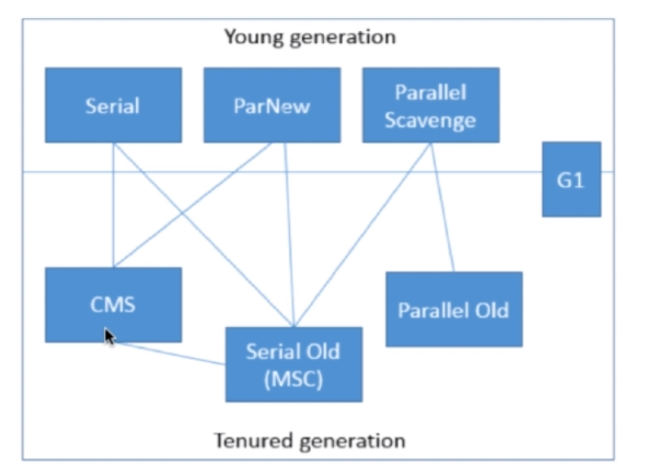

 

        1.Serial收集器

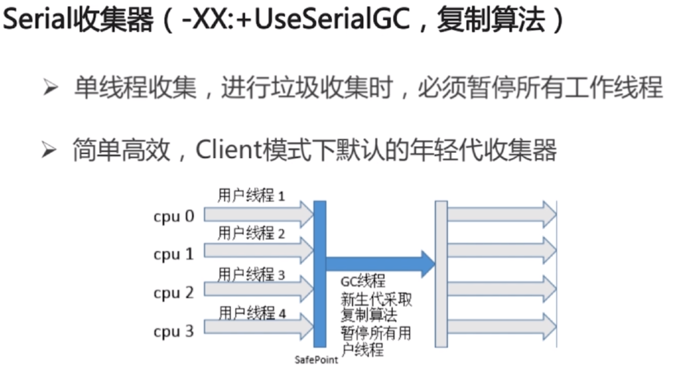

 
        
        2.ParNew收集器

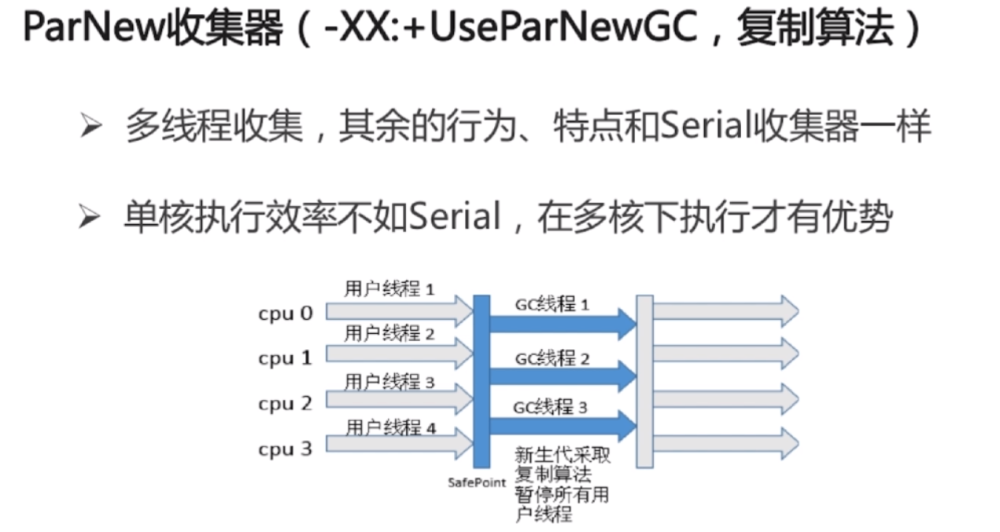

 

        3.Parallel Scavenge收集器

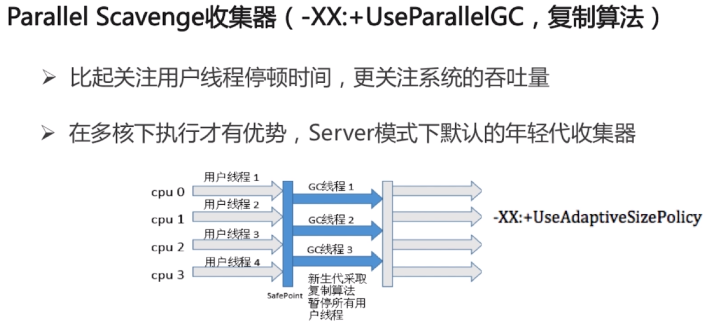

 
         
        1.通过参数-XX:GCTimeRadio设置垃圾回收时间占总CPU时间的百分比
        2.通过参数-XX:MaxGCPauseMillis设置垃圾处理过程最久停顿时间。Parallel Scavenge会根据这个值的大小确定新生代的大小。如果这个值越小，新生代就会越小，从而收集器就能以较短的时间进行一次回收。但新生代变小后，回收的频率就会提高，因此要合理控制这个值
        3.通过命令-XX:+UseAdaptiveSizePolicy就能开启自适应策略。我们只要设置好堆的大小和MaxGCPauseMillis或GCTimeRadio，收集器会自动调整新生代的大小、Eden和Survior的比例、对象进入老年代的年龄，以最大程度上接近我们设置的MaxGCPauseMillis或GCTimeRadio

        4.Serial Old收集器

 

        5.Parallel Old收集器

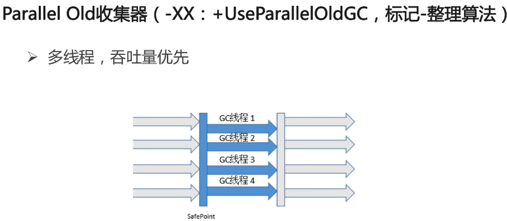

 

        6.CMS收集器

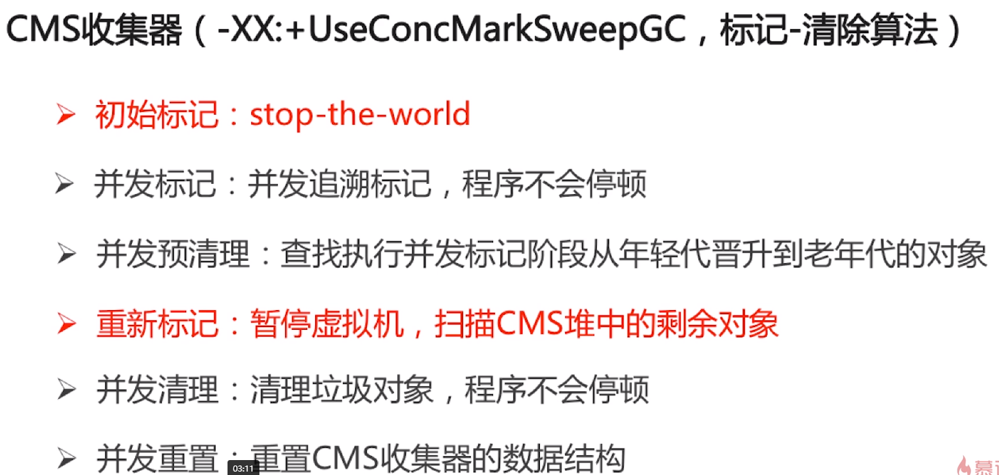
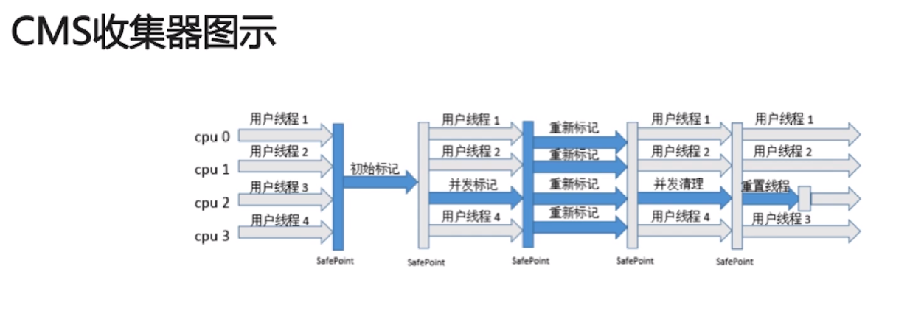

 

        6.G1收集器

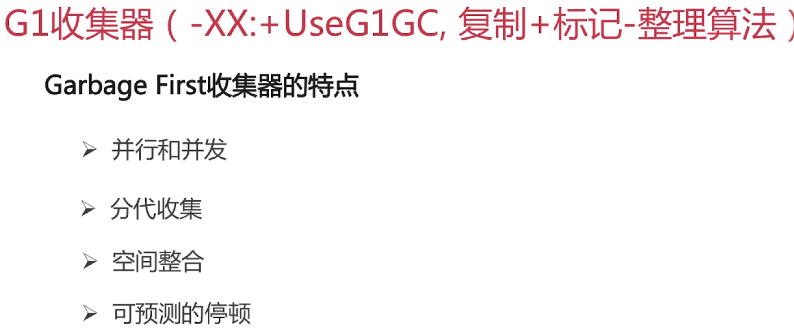
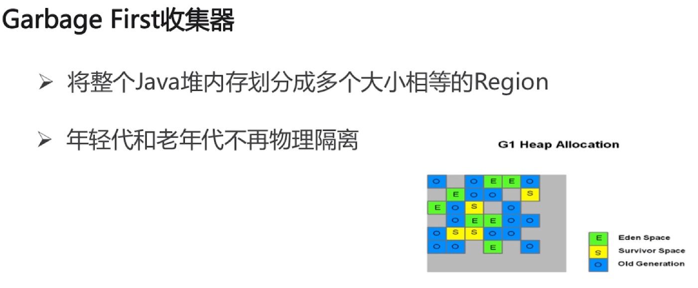

 

17. object的finalize（）方法的作用是否与C++的析构函数的作用相同 ：当JVM筛选出失效的对象之后，并不是立即清除，而是再给对象一次重生的机会，具体过程如下；
判断该对象是否覆盖了finalize()方法，
若已覆盖该方法，并该对象的finalize()方法还没有被执行过，那么就会将finalize()扔到F-Queue队列中；
，若未覆盖该方法，则直接释放对象内存。执行F-Queue队列中的finalize()方法 
虚拟机会以较低的优先级执行这些finalize()方法们，也不会确保所有的finalize()方法都会执行结束。如果finalize()方法中出现耗时操作，虚拟机就直接停止执行，将该对象清除。
对象重生或死亡 
如果在执行finalize()方法时，将this赋给了某一个引用，那么该对象就重生了。如果没有，那么就会被垃圾收集器清除。

- 注意： 
强烈不建议使用finalize()函数进行任何操作！如果需要释放资源，请使用try-finally。 
因为finalize()不确定性大，开销大，无法保证顺利执行。
18. java中的强引用，软引用，弱引用，虚引用有什么用：

 

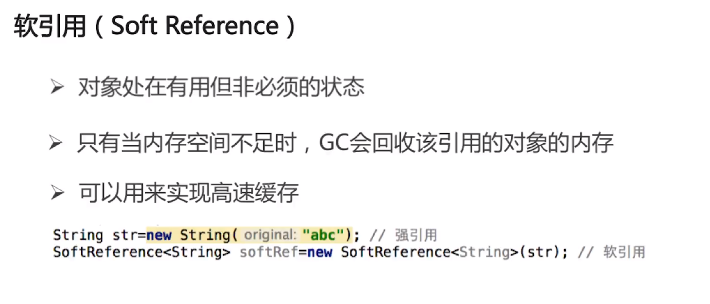

 

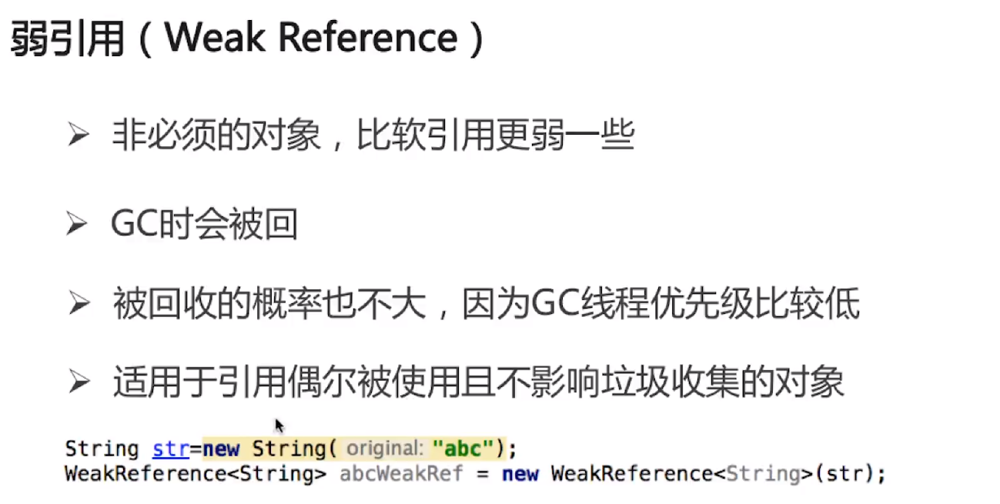

 

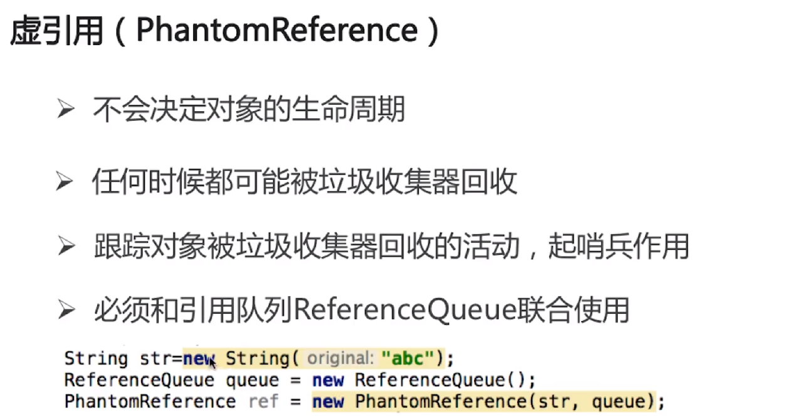

 

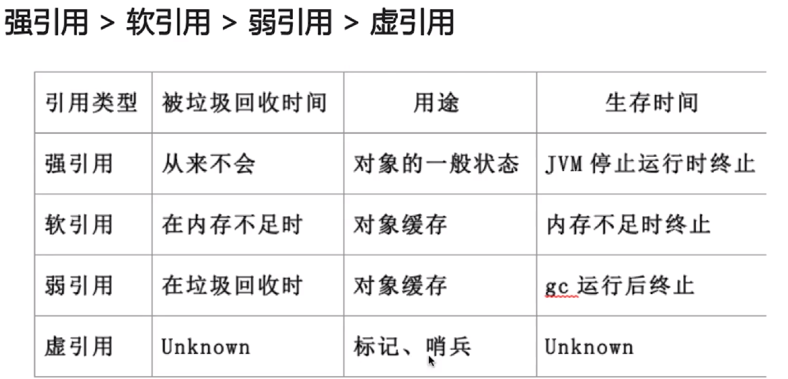

 

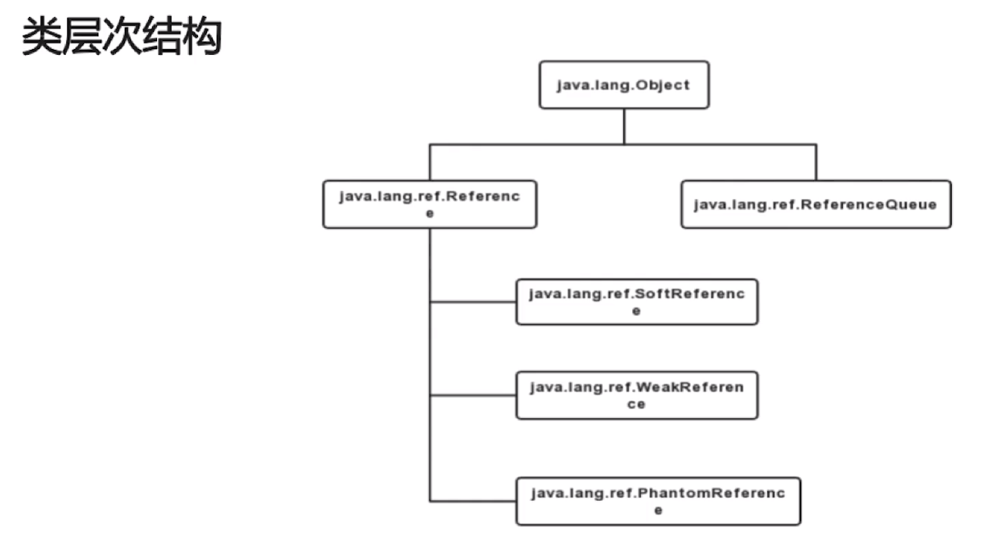

 

 

19. 如何判定废弃常量？清除废弃的常量和清除对象类似，只要常量池中的常量不被任何变量或对象引用，那么这些常量就会被清除掉。
20. 如何废弃废弃的类？

        该类的所有对象都已被清除
        该类的java.lang.Class对象没有被任何对象或变量引用 
        加载该类的ClassLoader已经被回收
21. 什么是分配担保？ 
当垃圾收集器准备要在新生代发起一次MinorGC时，首先会检查“老年代中最大的连续空闲区域的大小 是否大于 新生代中所有对象的大小？”，也就是老年代中目前能够将新生代中所有对象全部装下？
若老年代能够装下新生代中所有的对象，那么此时进行MinorGC没有任何风险，然后就进行MinorGC。
若老年代无法装下新生代中所有的对象，那么此时进行MinorGC是有风险的，垃圾收集器会进行一次预测：根据以往MinorGC过后存活对象的平均数来预测这次MinorGC后存活对象的平均数。
如果以往存活对象的平均数小于当前老年代最大的连续空闲空间，那么就进行MinorGC，虽然此次MinorGC是有风险的。
如果以往存活对象的平均数大于当前老年代最大的连续空闲空间，那么就对老年代进行一次Full GC，通过清除老年代中废弃数据来扩大老年代空闲空间，以便给新生代作担保。
这个过程就是分配担保。
## class文件的机构
1. 魔数：class文件的头4个字节称为魔数，用来表示这个class文件的类型
2. 版本信息：在高版本的JVM上能够运行低版本的class文件，但在低版本的JVM上无法运行高版本的class文件
3. 常量池：
- 字面值常量 
字面值常量即我们在程序中定义的字符串、被final修饰的值。
- 符号引用 
符号引用就是我们定义的各种名字： 
类和接口的全限定名
字段的名字 和 描述符
方法的名字 和 描述符
4. 访问标志：在常量池之后是2字节的访问标志。访问标志是用来表示这个class文件是类还是接口、是否被public修饰、是否被abstract修饰、是否被final修饰等。 
由于这些标志都由是/否表示，因此可以用0/1表示。 
访问标志为2字节，可以表示16位标志，但JVM目前只定义了8种，未定义的直接写0。
5. 类索引、父类索引、接口索引集合：类索引、父类索引、接口索引集合是用来表示当前class文件所表示类的名字、父类名字、接口们的名字。 
它们按照顺序依次排列，类索引和父类索引各自使用一个u2类型的无符号常量，这个常量指向CONSTANT_Class_info类型的常量，该常量的bytes字段记录了本类、父类的全限定名。 
由于一个类的接口可能有好多个，因此需要用一个集合来表示接口索引，它在类索引和父类索引之后。这个集合头两个字节表示接口索引集合的长度，接下来就是接口的名字索引。
6. 字段表的集合：
接下来是字段表的集合。字段表集合用于存储本类所涉及到的成员变量，包括实例变量和类变量，但不包括方法中的局部变量。 
每一个字段表只表示一个成员变量，本类中所有的成员变量构成了字段表集合
- access_flags: 
字段的访问标志。在Java中，每个成员变量都有一系列的修饰符，和上述class文件的访问标志的作用一样，只不过成员变量的访问标志与类的访问标志稍有区别
- name_index:本字段名字的索引。指向一个CONSTANT_Class_info类型的常量，这里面存储了本字段的名字等信息。
- descriptor_index :
描述符。用于描述本字段在Java中的数据类型等信息,对于字段而言，描述符用于描述字段的数据类型； 
对于方法而言，描述符用于描述字段的数据类型、参数列表、返回值
- attributes_count: 
属性表集合的长度
- attributes :
属性表集合。到descriptor_index为止是字段表的固定信息，光有上述信息可能无法完整地描述一个字段，因此用属性表集合来存放额外的信息，比如一个字段的值。(下面会详细介绍)
7. 方法表：在class文件中，所有的方法以二维表的形式存储，每张表来表示一个函数，一个类中的所有方法构成方法表的集合。 
方法表的结构和字段表的结构一致，只不过访问标志和属性表集合的可选项有所不同
8. 属性表：在Class文件、字段表和方法表都可以携带自己的属性信息，这个信息用属性表进行描述，用于描述某些场景专有的信息（java程序方法体中的代码经过javac编译器处理后，最终变为字节码指令存储在Code属性内）

