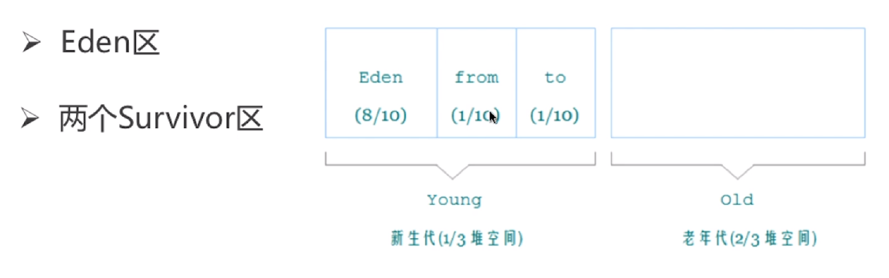
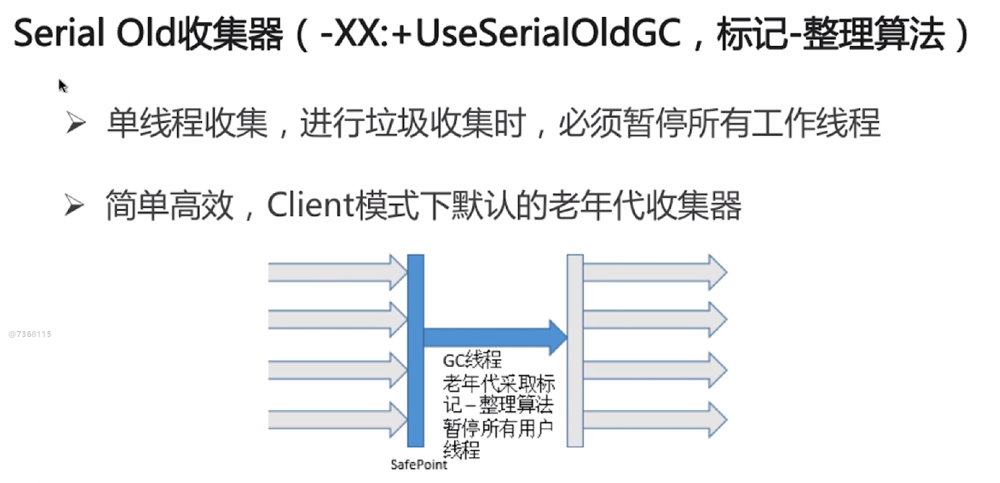
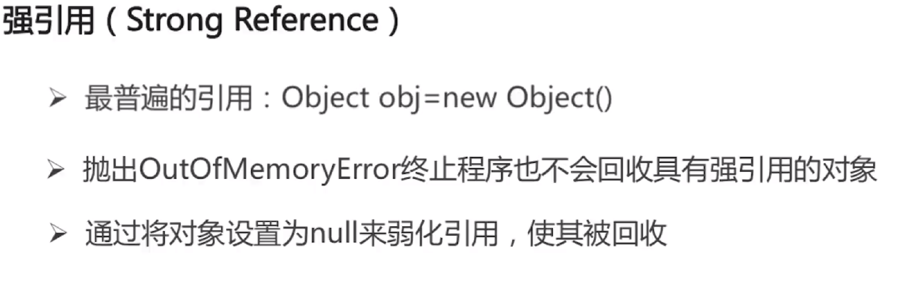
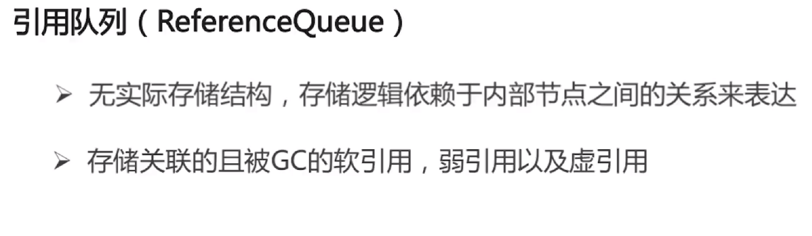

* [JVM](#JVM)
    * [平台无关性](#平台无关性)
    * [反射](#反射)
    * [内存模型](#内存模型)
    * [java垃圾回收](#java垃圾回收)
  
# JVM

 

## 平台无关性

 

1. 为什么JVM不直接将源码解析成机器码去执行：
        
         1.准备工作：每次执行需要各种检查（语法，句法等）
         2.兼容性：也可以将别的语言解析成字节码

2. JVM如何加载.class文件:

 

## 反射
1. 反射：java反射机制是在运行状态中，对于任意一个类，都能够知道这个类的所有属性和方法，对于任意一个对象，都能够调用它的任意方法和属性，这种动态获取信息以及动态调用对象方法的功能成为java语言的反射机制。[代码实现](https://github.com/joeyleee/Notes/tree/master/code/javabasic/src/reflrct)
2. 类从编译到执行的过程：编译器将.java源文件编译为.class字节码文件，classloader将字节码转换为JVM中的Class<>对象，JVM利用Class<>对象实例化。
3. ClassLoader：ClassLoader在java中有着非常重要的作用，它主要工作在class装载的加载阶段，其主要作用是从系统外部获得class二进制数据流。它是java的核心组件，所有的class都是由classloader进行加载的，classloader负责通过将class文件里的二进制数据流装载进系统，然后交给java虚拟机进行连接，初始化等操作。
4. classloader的种类：

        1. BootStrapClassLoader：C++编写，加载核心库java.*
        2. ExtClassLoader:java编写，加载扩展库javax.*
        3. AppclassLoader:java编写，加载程序所在目录
        4. 自定义classloader：java编写，定制化加载
5. 自定义ClassLoader的实现：

 

[代码实现](https://github.com/joeyleee/Notes/tree/master/code/javabasic/src/reflrct)

6. 类加载器的双亲委派机制：

 

7. 为什么使用双亲委派机制去加载类：避免多份同样字节码的加载。
8. 类的加载方式：
        1.隐式加载：new
        2.显示加载：loadClass,forName
9. loadClass和forName的区别：类的加载过程

 

forName()得到的class是已经初始化完成的，loadClass得到的class是还没有连接的

## 内存模型
1. 内存简介：

 

2. 地址空间划分：
        
        1.内核空间：操作系统使用的，32位 1GB
        2.用户空间：程序使用的，32位 3GB

3. JVM内存模型：

 

4. （线程私有）程序计数器：当前线程执行的字节码行号指示器（逻辑），改变计数器的值来选取吓一跳需要执行的字节码指令，和线程是一对一的关系即线程私有，对java方法计数，如果是native方法则计数器值为undifined,不会发生内存泄露
5. （线程私有）java虚拟机栈：

 

6. 局部变量表：包含方法执行过程中的所有变量
7. 操作数栈：入栈，出栈，复制，交换，产生消费变量

 

8. 递归为什么会引起java.lang.stackOverflowError异常:递归过深，栈帧数抄书虚拟机栈深度
9. 虚拟机栈过多会引发java.lang.outOfMememoryError:

 

10. （线程私有）本地方法栈：与虚拟机栈相似，主要作用于标注了native的方法
11. 元空间与永久代的区别：元空间使用本地内存，而永久代使用JVM内存，java.lang.OutOfMemoryError:pernGen space不再存在
12. metaSpace相比PermGen的优势：字符串常量池存在于永久代中，容易出现性能问题和内存溢出，类和方法的信息大小难以确定，给永久代的大小指定带来困难，永久代会为GC带来不必要的复杂度，方便hotspot与其他jvm如jrockit的集成。
13. java堆：

 

14. jvm三大性能调优参数：

        1.-Xss:规定了每个线程虚拟机栈（堆栈）的大小（一般256k足够）
        2.-Xms:堆的初始值
        3.-Xmx:堆能达到的最大值
15. java内存模型中堆和栈的区别——内存分配策略
        
        1.静态存储：编译时确定每个数据目标在运行时的存储空间要求
        2.栈式存储：数据区需求在编译时未知，运行时模块入口前确定
        3.堆式存储：编译时或运行时模块入口都无法确定，动态分配
16. java内存模型中堆和栈的区别：
        
        1.管理方式：栈自动释放，堆需要GC
        2.空间大小：栈比堆小
        3.碎片相关：栈产生的碎片远小于堆
        4.分配方式：栈支持静态和动态分配，而堆仅支持动态分配
        5.效率：栈的效率比堆高
        6.联系：引用对象，数组时，栈里定义变量保存堆中目标的首地址
17. 元空间，堆，线程独占部分间的联系——内存角度：

 

 

18. 不同jdk版本之间的intern()方法的区别-JDK6 和JDK6+：
        
        6:当调用intern方法时，如果字符串常量池先前已经创建了该字符串的对象，则返回池中的该字符串的引用。否则，将此字符串对象添加到字符串常量池中，并且返回该字符串对象的引用。
        6+：当调用intern方法时，如果字符串常量池先前已创建出该字符串对象，则返回池中该字符串的引用。否则，如果该字符串对象已经存在于java堆中，则将堆中对此对象的引用添加到字符串常量池中，并且返回该引用，如果堆中不存在，则在池中创建该字符串并返回其引用。

## java垃圾回收
1. 对象被判定为垃圾的标准：没有被其他对象引用
2. 判定对象是否为垃圾的算法：
        
        1.引用计数算法：通过判断对象的引用数量来决定对象是否可以被回收，每个对象实例都有一个引用计数器，被引用则+1，完成引用则-1，任何引用计数为0的对象实例可以被当做垃圾收集，优点：执行效率高，程序执行受影响较小，缺点：无法检测出循环引用的情况，导致内存泄漏。
        2.可达性分析算法：

 

3. 可以作为GC root的对象：
        
        1.虚拟机栈中引用的对象（栈帧中的本地变量表）
        2.方法区中的常量引用的对象
        3.方法区中的类静态属性引用的对象
        4.本地方法栈中jni（native方法）的引用对象
        5.活跃线程的引用对象
4. 标记——清除算法：

 

5. 复制算法：

 

6. 标记——整理算法：

 

7. 分代收集算法：

 

 

8. 年轻代：尽可能快速地收集掉那些生命周期短的对象

 

9. 对象如何晋升到老年代：经历一定minor次数依然存活的对象，达到MaxTenuringThreshold设置的年龄，默认15岁，survivor区中存放不下的对象，新生成的大对象（PretenuserSizeThreshold）
10. 常用调优参数：

        1.-XX:SurvivorRation:Eden和Survivor的比值默认为8:1
        2.-XX:NewRatio:老年代和年轻代内存大小的比例
        3.-XX:MaxTenuringThreshold:对象从年轻代晋升到老年代经过GC次数的最大阈值

11. 老年代：存放生命周期较长的对象采用标记——清理或者标记——整理算法。
12. 触发Full GC的条件：老年代空间不足，永久代空间不足，CMS GC时出现promotion failed,concurrent mode failure,Minor Gc晋升到老年代的平均大小大于老年代的剩余空间，调用System.gc()，使用RMI来进行RPC或管理的JDK应用，每小时执行一次FULL GC
13. stop-the-world：jvm由于要执行gc而停止了应用程序的执行，任何一种GC算法都会发生，多数gc优化通过减少stop-the-world发生的时间来提高程序的性能
14. safe-point:分析进程中对象引用关系不会发生变化的点，产生这个点的地方：方法调用，循环跳转，异常跳转等，安全点数量得适中。
15. jvm的运行模式：server模式，启动慢，但是运行速度快，client模式,启动快，但是运行速度慢
16. 常见的垃圾收集器：

 

        1.Serial收集器

 
        
        2.ParNew收集器

 

        3.Parallel Scavenge收集器

 

        4.Serial Old收集器

 

        5.Parallel Old收集器

 

        6.CMS收集器

 

        6.G1收集器

 

17. object的finalize（）方法的作用是否与C++的析构函数的作用相同 ：与C++的析构函数不同，析构函数调用确定，而它不确定，将未被引用的对象放置于F-Queue队列，方法执行随时可能会被终止，给予对象最后一次重生的机会
18. java中的强引用，软引用，弱引用，虚引用有什么用：

 

 

 

 

 

 

 

