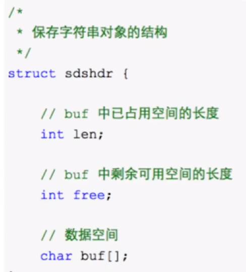
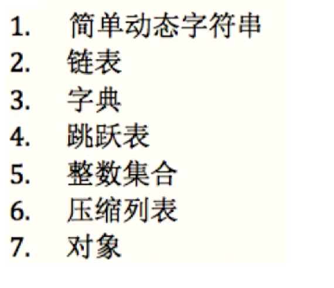
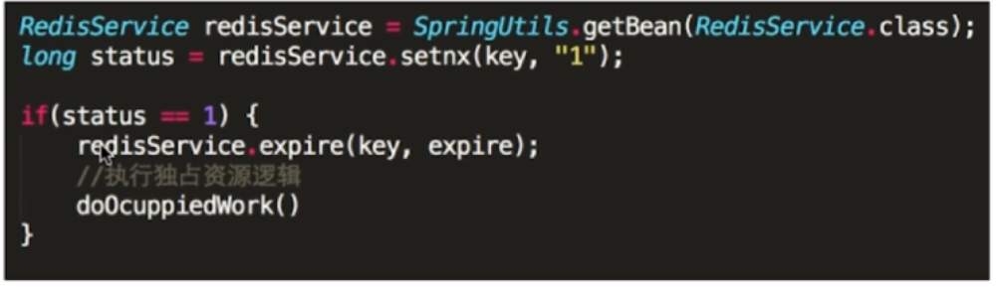
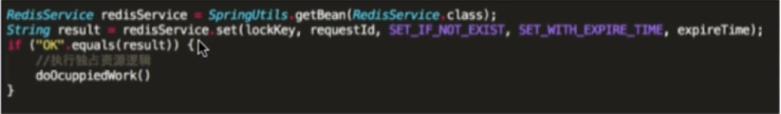
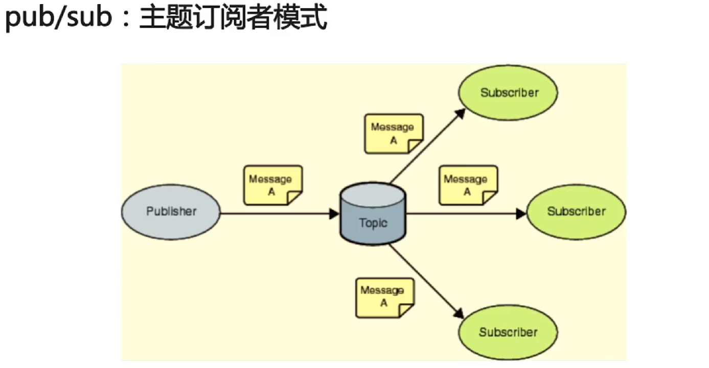

* [redis](#redis)
    * [简介](#简介)
    * [java集合框架](#java集合框架)
    * [java的I/O](#java的I/O)

  
# Redis
## 简介
1. 缓存中间件——Memcache和Redis的区别

      Memcache：代码层次类似Hash,支持简单数据类型，不支持数据持久化存储，不支持主从，不支持分片
      Redis:数据类型丰富，支持数据磁盘持久化存储，支持主从，支持分片
2. 为什么redis能这么快：100000+QPS（每秒查询次数）

        完全基于内存，绝大部分请求是存粹的内存操作，执行效率较高
        数据结构简单，对数据操作也简单
        采用单线程，单线程也能处理高并发请求，想多核也可启动多实例
        使用多路I/O服用模型，非阻塞IO
3. FD:File Descriptor,文件描述符

        一个打开的文件通过唯一的描述符进行引用，该描述符是打开文件的元数据到文件本身的映射。
4. 多路I/O复用模型：epoll,kqueue,evport,select

        因地制宜
        优先选择时间复杂度为为O（1）的I/O多路复用函数作为底层实现
        以时间复杂度为O（n）的select作为保底（因为都有实现）
        基于react设计模式舰艇I/O事件
5. 说说你用过的redis的数据类型：

        String：最基本的数据类型，二进制安全

 
        Hash:String元素组成的字典，适合用于存储对象
        List：列表，按照String元素插入顺序排序（后进先出）
        Set：String元素组成的无序集合，通过哈希表实现，不允许重复
        SortedSet:通过分数来为集合中的成员进行从小到大的排序
        用来计数的Hyperloglog，用于支持存储地理位置信息的Geo

6. 底层数据类型基础：

 

7. 使用keys对线上的业务影响：keys patttern：查找所有符合给定模式pattern的key(可能会阻塞服务器)
8. 使用 scan cursor[MATCH pattern][COUNT count]（可能获取到重复key，需要自己去重）
        
        基于游标的迭代器，需要基于上一次的游标延续之前的迭代过程
        以0作为游标开始一次新的迭代，知道命令返回有游标0完成一次遍历
        不保证每次执行都返回某个给定数量的元素，支持模糊查询
        一次返回的数量不可控，只能是大概率符合count参数
9. 分布式锁需要解决的问题：

        互斥性：任意时刻只能有一个客户端获取锁
        安全性：锁只能被持有该锁的客户端删除，不能被其他客户端删除
        死锁：避免死锁
        容错：部分节点宕机，仍能获取琐释放锁
10. setnx key value:如果key不存在，则创建并赋值，如果存在就失败，可以实现锁的功能

        时间复杂度：O（1）
        返回值：设置成功，返回1；设置失败，返回0
11. 如何解决setnx长期有效的问题：

        expire key seconds:设置key的生存时间，当key过期时，会别自动删除

 
        
        但是存在问题，如果刚刚setnx程序就挂掉了，来不及expire，就会产生死锁，是因为这个操作不是原子的
        set key value[EX seconds][PX milliseconds][NX|XX]
        EX:设置键的过期时间为秒
        PX:设置键的过期时间为毫秒
        NX：只在键不存在时，才对键进行设置操作
        XX：只在键存在时，才对键进行设置操作
        set操作成功时，返回OK，否则返回nil

 

12. 大量的key同时过期的注意事项：集中过期，由于清除大量的Key很耗时，会出现短暂的卡顿现象，解决方案:在设置key的国企时间的时候，给每个Key加上随机值。
13. 如何使用redis做异步队列：
        
         使用list作为队列，rpush生产消息，lpop消费消息
         缺点：没有等待队列里有值就直接消费
         弥补：可以通过在应用层引入sleep机制去调用lpop重试

14. 如何使用redis做异步队列：blpop key[key ...]timeout:阻塞直到队列有消息或者超时  

        缺点：只能提供一个消费者消费

15. 如何使用redis做异步队列：pub/sub主题订阅者模式

        发送者(pub)发送消息，订阅者（sub）接受消息
        订阅者可有订阅任意数量的频道

 

        缺点：消息的发布时无状态的，无法保证可达（若想解决这个问题就要用专业的消息队列kafka）
16. redis如何做持久化：

        RDB（快照）持久化：保存某个时间点的全量数据快照
        save 900 1意思是900秒内有一条是写指令就触发产生一次快照
        stop-writes-on-bgsave-error yes(当备份进程出错的时候，主进程就停止接受新的写入操作，保护持久化数据的一致性)
        rdbcompression yes (储存备份文件的时候回压缩，建议是no,因为比较耗CPU)
17. 创建rdb文件的方法：

        sava:阻塞redis的服务器进程明知道rdb文件被创建完毕 （主进程来创建）
        bgsave:fork出一个子进程来创建RDB文件，不阻塞服务器进程       

