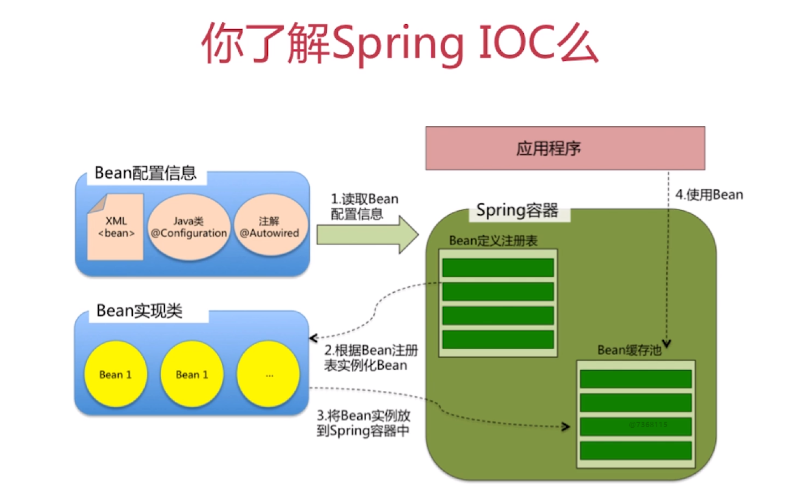
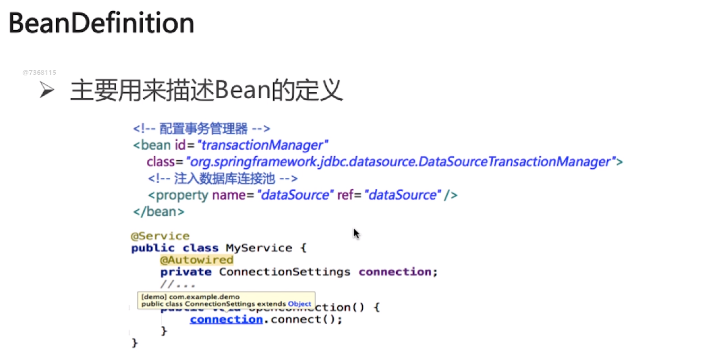
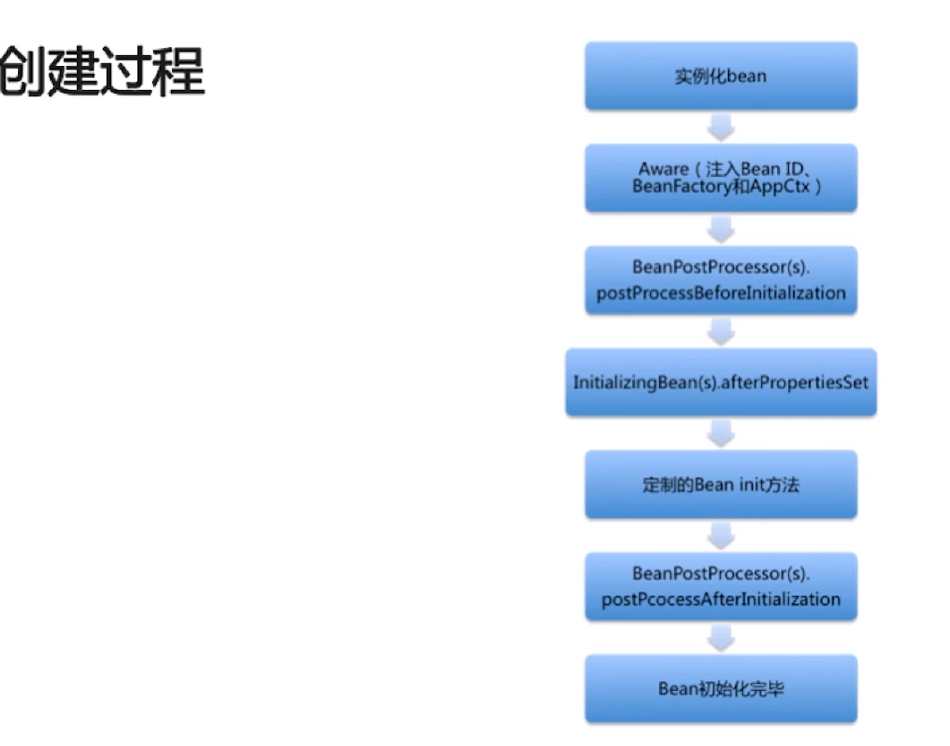
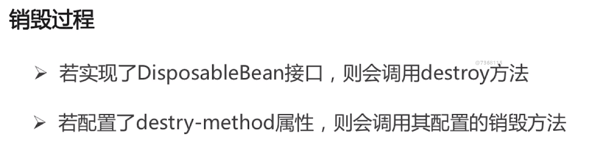

* [spring](#spring)
    * [IOC](#IOC)
    * [AOP](#AOP)
    

# spring

## IOC
1. 依赖注入：把底层类作为参数传递给上层类，实现上层对下层的控制。
2. IOC容器的优势：

        避免在各处使用new来创建类，并且可以做到统一维护
        创建实例的时候不需要了解其中的细节（都保存在配置信息中了）
<div align=center>


</div><br>

3. springIOC：支持依赖注入，依赖检查，自动装配，支持集合，指定初始化方法和销毁方法，支持回调方法
<div align=center>


</div><br>

4. beandefinition: spring在启动的时候将注解或者xml配置文件解析成beandefinition
<div align=center>


</div><br>

5. beanDefinitionRegistry:提供向IOC容器注册BeanDefinition对象的方法,以beanname为keybeandefinition为value存储到一个beanDifinitionMap里面。 
6. BeanFactory:Spring框架最核心的接口

        提供IOC的配置机制
        包含各种Bean的定义，便于实例化Bean
        建立Bean之间的依赖关系
        Bean生命周期的控制
一般情况下用过beanfactory的getbean()获得的bean都是单例的

7. BeanFactory与ApplicationContext的比较：

        BeanFactory是spring框架的基础设施，面向Spring
        ApplicationContext面向使用Spring框架的开发者

8. ApplicationContext的功能（继承多个接口）

        BeanFactory：能够管理，装配Bean
        ResourcePatternResolver:能够加载资源文件
        MessageSourse：能够实现国际化等功能
        ApplicationEventPublisher:能够注册监听器，实现监听机制
9. refresh方法：

        在创建完ioc容器之后调用，会解析bean，装在bean并在一些初始化的操作
        为IOC容器以及Bean的生命周期管理提供条件
        刷新Spring上下文信息，定义Spring上下文加载流程
        

10. getBean方法的代码逻辑：

        转换BeanName
        从缓存中加载实例
        实例化Bean
        检测parentBeanFactory
        初始化依赖的Bean
        创建Bean
11. Spring Bean的作用域：

        singleton（适用于无状态的bean）:Spring的默认作用域，容器里拥有唯一的Bean实例
        prototype（适用于有状态的bean）：针对每个getBean请求，容器都会创建一个Bean实例
        request：会为每个http创建一个bean
        session:会为每个session创建一个bean实例
        globalSession：会为每个全局Http Session创建一个Bean实例，该作用域仅对Portlet有效
12. Spring Bean的生命周期：
        
        1、实例化一个Bean－－也就是我们常说的new；

        2、按照Spring上下文对实例化的Bean进行配置－－也就是IOC注入；

        3、如果这个Bean已经实现了BeanNameAware接口，会调用它实现的setBeanName(String)方法，此处传递的就是Spring配置文件中Bean的id值

        4、如果这个Bean已经实现了BeanFactoryAware接口，会调用它实现的setBeanFactory(setBeanFactory(BeanFactory)传递的是Spring工厂自身（可以用这个方式来获取其它Bean，只需在Spring配置文件中配置一个普通的Bean就可以）；

        5、如果这个Bean已经实现了ApplicationContextAware接口，会调用setApplicationContext(ApplicationContext)方法，传入Spring上下文（同样这个方式也可以实现步骤4的内容，但比4更好，因为ApplicationContext是BeanFactory的子接口，有更多的实现方法）；

        6、如果这个Bean关联了BeanPostProcessor接口，将会调用postProcessBeforeInitialization(Object obj, String s)方法，BeanPostProcessor经常被用作是Bean内容的更改，并且由于这个是在Bean初始化结束时调用那个的方法，也可以被应用于内存或缓存技术；

        7、如果Bean在Spring配置文件中配置了init-method属性会自动调用其配置的初始化方法。

        8、如果这个Bean关联了BeanPostProcessor接口，将会调用postProcessAfterInitialization(Object obj, String s)方法、；

        注：以上工作完成以后就可以应用这个Bean了，那这个Bean是一个Singleton的，所以一般情况下我们调用同一个id的Bean会是在内容地址相同的实例，当然在Spring配置文件中也可以配置非Singleton，这里我们不做赘述。

        9、当Bean不再需要时，会经过清理阶段，如果Bean实现了DisposableBean这个接口，会调用那个其实现的destroy()方法；

        10、最后，如果这个Bean的Spring配置中配置了destroy-method属性，会自动调用其配置的销毁方法。


<div align=center>


</div><br>
<div align=center>


</div><br>

## AOP
1. Spring AOP:

        面向切面编程AOP正时此种技术的体现
        通用化功能代码的实现，对应的就是所谓的切面
        业务功能代码和切面代码分开后，架构将变得高内聚低耦合
        确保功能的完整性，切面最终需要被合并到业务中
2. AOP的三种织入方式：

        编译时：需要特殊的java编译器，Aspectj
        类加载时：需要特殊的java编译器，Aspectj和AspectWerkz
        运行时：Spring采用的方式，通过动态代理的方式，实现简单
3. AOP的主要名词概念：

        Aspect:通用功能的代码实现
        Target:被织入Aspect的对象
        Join Point:可以作为切入点的机会，所有方法都可以作为切入点
        Pointcut:Aspect实际被应用在的Join Point，支持正则（用来签名所要使用的方法）
        Advice:类里的方法以及这个方法如何织入到目标方法的方式
        Weaving:AOP的实现过程
4. Advice的种类:前置通知（before），后置通知（AfterReturning），异常通知（AfterThrowing）,最终通知（After），环绕通知（Around）
5. AOP的实现：JDKProxy和CGlib

        由AopProxyFactory根据AdvisedSupport对象的配置来决定
        默认策略如果目标类是接口，则用JDKProxy来实现，否则用后者
        JDKProxy的核心：InvocationHandler接口和Proxy类
        Cglib:以继承的方式动态生成目标类的代理(如果某个类是final的则不能使用)
        实现原理：
        JDKProxy:通过JAVA的内部反射机制实现
        Cglib:借助ASM实现（操作字节码）
        优缺点：
        反射机制在生成类的过程中比较高效
        ASM在成成类之后的执行过程中比较高效
6. 代理模式：接口+真实实现类+代理类(静态代理)
```java
interface Subject {
    void request();
}

class RealSubject implements Subject {
    public void request(){
        System.out.println("RealSubject");
    }
}

class Proxy implements Subject {
    private Subject subject;

    public Proxy(Subject subject){
        this.subject = subject;
    }
    public void request(){
        System.out.println("begin");
        subject.request();
        System.out.println("end");
    }
}

public class ProxyTest {
    public static void main(String args[]) {
        RealSubject subject = new RealSubject();
        Proxy p = new Proxy(subject);
        p.request();
    }
}

```
7. Spring里代理模式的实现：

        真实实现类的逻辑包含在了getBean方法里
        getBean方法返回的上实际上是Proxy的实例
        Peoxy实例是Spring采用JDK Proxy或CGLIB动态生成的
8.Spring事务的相关考点：ACID,隔离级别,事务传播（补充）
