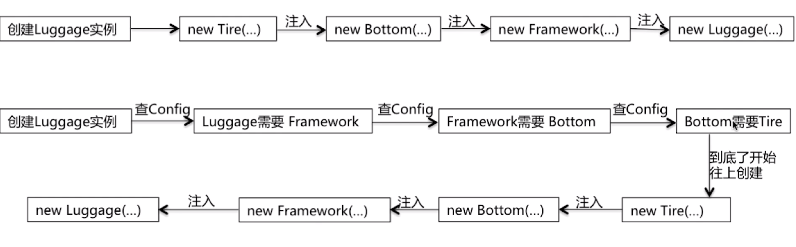

* [spring](#spring)
    * [IOC](#IOC)
    * [AOP](#AOP)
    

# spring

## IOC
1. 依赖注入：把底层类作为参数传递给上层类，实现上层对下层的控制。
2. IOC容器的优势：

        避免在各处使用new来创建类，并且可以做到统一维护
        创建实例的时候不需要了解其中的细节

 

3. springIOC：支持依赖注入，依赖检查，自动装配，支持集合，指定初始化方法和销毁方法，支持回调方法

 

4. beandefinition: 

 

5. beanDefinitionRegistry:提供向IOC容器注册BeanDefinition对象的方法 
6. BeanFactory:Spring框架最核心的接口

        提供IOC的配置机制
        包含各种Bean的定义，便于实例化Bean
        建立Bean之间的依赖关系
        Bean生命周期的控制

7. BeanFactory与ApplicationContext的比较：

        BeanFactory是spring框架的基础设施，面向Spring
        ApplicationContext面向使用Spring框架的开发者

8. ApplicationContext的功能（继承多个接口）

        BeanFactory：能够管理，装配Bean
        ResourcePatternResolver:能够加载资源文件
        MessageSourse：能够实现国际化等功能
        ApplicationEventPublisher:能够注册监听器，实现监听机制
9. refresh方法：

        为IOC容器以及Bean的生命周期管理提供条件
        刷新Spring上下文信息，定义Spring上下文加载流程

10. getBean方法的代码逻辑：

        转换BeanName
        从缓存中加载实例
        实例化Bean
        检测parentBeanFactory
        初始化依赖的Bean
        创建Bean
11. Spring Bean的作用域：

        singleton:Spring的默认作用域，容器里拥有唯一的Bean实例
        prototype：针对每个getBean请求，容器都会创建一个Bean实例
        request：会为每个http创建一个bean
        session:会为每个session创建一个bean实例
        globalSession：会为每个全局Http Session创建一个Bean实例，该作用域仅对Portlet有效
12. Spring Bean的生命周期：

 

 

## AOP
1. Spring AOP:

        面向切面编程AOP正时此种技术的体现
        通用化功能代码的实现，对应的就是所谓的切面
        业务功能代码和切面代码分开后，架构将变得高内聚低耦合
        确保功能的完整性，切面最终需要被合并到业务中
2. AOP的三种织入方式：

        编译时：需要特殊的java编译器，Aspectj
        类加载时：需要特殊的java编译器，Aspectj和AspectWerkz
        运行时：Spring采用的方式，通过动态代理的方式，实现简单
3. AOP的主要名词概念：

        Aspect:通用功能的代码实现
        Target:被织入Aspect的对象
        Join Point:可以作为切入点的机会，所有方法都可以作为切入点
        Pointcut:Aspect实际被应用在的Join Point，支持正则
        Advice:类里的方法以及这个方法如何织入到目标方法的方式
        Weaving:AOP的实现过程
4. Advice的种类:前置通知（before），后置通知（AfterReturning），异常通知（AfterThrowing）,最终通知（After），环绕通知（Around）
5. AOP的实现：

        由AopProxyFactory根据AdvisedSupport对象的配置来决定
        默认策略如果目标类是接口，则用JDKProxy来实现，否则用后者
        JDKProxy的核心：InvocationHandler接口和Proxy类
        Cglib:以继承的方式动态生成目标类的代理
        JDKProxy:通过JAVA的内部反射机制实现
        Cglib:借助ASM实现（操作字节码）
        反射机制在生成类的过程中比较高效
        ASM在成成类之后的执行过程中比较高效
6. 代理模式：接口+真实实现类+代理类
7. Spring里代理模式的实现：

        真实实现类的逻辑包含在了getBean方法里
        getBean方法返回的上实际上是Proxy的实例
        Peoxy实例是Spring采用JDK Proxy或CGLIB动态生成的
8.Spring事务的相关考点：ACID,隔离级别,事务传播（补充）
