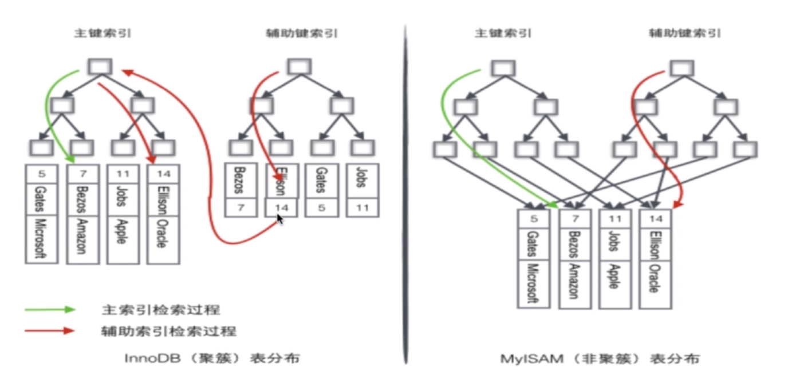

* [数据库知识](#数据库知识)
    * [数据库架构](#数据库架构)
    * [索引](#索引)
    * [锁模块](#锁模块)
    * [关键语法](#关键语法)
    * [三个范式](#三个范式)
    * [常见考题](#常见考题)
  
# 数据库知识
## 数据库架构

 

## 索引
1. 为什么要使用索引：快速查询数据。
2. 什么样的信息能成为索引：主键，唯一键以及普通键等。
3. 索引的数据结构：二叉查找树，B树，B+树，Hash结构。
4. 二叉查找树：可能会形成一个线性的树，其效率很低，若使用平衡二叉查找树，则旋转的成本很高，只适用于插入和删除比较少，查找比较多的环境。
5. B树：
       
       1.定义任意非叶子结点最多只有M个儿子；且M>2；

       2.根结点的儿子数为[2, M]；

       3.除根结点以外的非叶子结点的儿子数为[M/2, M]；

       4.每个结点存放至少M/2-1（取上整）和至多M-1个关键字；（至少2个关键字）

       5.非叶子结点的关键字个数=指向儿子的指针个数-1；

       6.非叶子结点的关键字：K[1], K[2], …, K[M-1]；且K[i] < K[i+1]；

       7.非叶子结点的指针：P[1], P[2], …, P[M]；其中P[1]指向关键字小于K[1]的

       子树，P[M]指向关键字大于K[M-1]的子树，其它P[i]指向关键字属于(K[i-1], K[i])的子树；

       8.所有叶子结点位于同一层；

 
6. B+树:
        
       1.其定义基本与B-树同，除了：

       2.非叶子结点的子树指针与关键字个数相同；

       3.非叶子结点的子树指针P[i]，指向关键字值属于[K[i], K[i+1])的子树

       （B-树是开区间）；

       4.为所有叶子结点增加一个链指针；

       5.所有关键字都在叶子结点出现，数据只存放在叶子节点，所以查询结束于叶子节点；

 

7. B+树的优势：B+树的磁盘速写代价更低，查询效率更稳定，更有利于对数据库的扫描
8. Hash索引：缺点：仅仅满足=，in不能使用范围查询，无法被用来避免数据的排序操作，不能利用部分索引键查询，不能避免表扫描，遇到大量HASH值相等的情况后并一定效率高。
9. BITMAP：位图索引适合只有几个固定值的列，如性别、婚姻状况、行政区等等，而身份证号这种类型不适合用位图索引，另外位图索引适合静态数据，而不适合索引频繁更新的列，因为位图索引需要锁定行值。
10. 密集索引和稀疏索引的区别：密集索引文件中每个搜索码值都对应一个索引值，稀疏索引文件只为索引码的某些值建立索引项
11. InnoDB:若一个主键被定义，则主键为密集索引，若没有主键被定义，该表的第一个唯一非空索引作为密集索引，若不满足上述条件，innodb内部会生成一个隐藏主键作为索引，非主键索引存储相关键位和其对应的主键值，包括两次查找：

 

12. 如何定位并优化慢查询sql: 

        1.根据慢日志定位慢查询sql
        2.使用explain等工具分析sql（explain selct * from biao）
        3.修改sql或者尽量让sql走索引

13. 联合索引的最左匹配原则：若a和b都为索引，当查询ab和a时会走这个索引,但是查询b时不会走这个索引，其中=和in可以乱序，但是遇见范围查询（>,<,between,like）就停止匹配。
14. 最左匹配原则的成因：mysql对先根据第一个索引进行排序，然后再根据第二个索引排序，所以只有第一个是绝对有序的，后边的不是相对有序的。
15. 索引是建立的越多越好么：

        1.数据量小的表不需要建立索引，建立会增加额外的索引开销
        2.数据变更需要维护索引，因此更多的索引意味着更多的维护成本 
        3.更多的索引意味着更多的存储空间
16. 聚集索引和非聚集索引：数据行的物理顺序与列值（一般是主键的那一列）的逻辑顺序相同，一个表中只能拥有一个聚集索引，聚集索引的数据页存放的是完整的记录；该索引中索引的逻辑顺序与磁盘上行的物理存储顺序不同，一个表中可以拥有多个非聚集索引，非聚集索引的数据页只存指向记录的地址信息。
17. 聚簇索引：可以把相关的数据保存在一起，一个表只能有一个聚簇索引。
18. 那些情况需要加索引：
                
        在经常需要搜索的列上，可以加快搜索的速度；
        在作为主键的列上，强制该列的唯一性和组织表中数据的排列结构；
        在经常用在连接的列上，这些列主要是一些外键，可以加快连接的速度；
        在经常需要根据范围进行搜索的列上创建索引，因为索引已经排序，其指定的范围是连续的；
        在经常需要排序的列上创建索引，因为索引已经排序，这样查询可以利用索引的排序，加快排序查询时间；
        在经常使用在WHERE子句中的列上面创建索引，加快条件的判断速度。

## 锁模块
1. myisam默认用表级锁，不支持行级锁，innodb默认用行级锁，支持表级锁
2. Myisam适用的场景：频繁执行全表count语句，对数据进行增删改的频率不高，主要执行查询，没有事务
3. Innodb适用的场景：数据增删改查都比较频繁，可靠性要求比较高，要求支持事务
4. 按锁的粒度划分：表级锁，行级锁，页级锁（一组数据）
5. 按锁级别划分：共享锁，排它锁；共享锁就是多个事务对于同一数据可以共享一把锁，都能访问到数据，但是只能读不能修改；排他锁就是不能与其他所并存，如一个事务获取了一个数据行的排他锁，其他事务就不能再获取该行的其他锁，包括共享锁和排他锁，但是获取排他锁的事务是可以对数据就行读取和修改。
6. 按加锁方式划分：自动锁和显示锁
7. 按操作划分：DML锁，DDL锁
8. 按使用方式划分：乐观锁，假设不会发生并发冲突，只在提交操作时检查是否违反数据完整性（添加数据的版本信息，来保证数据的一致性）；悲观锁，假定会发生并发冲突，屏蔽一切可能违反数据完整性的操作
9. 数据库事务的四大特性：原子性，一致性，隔离性，持久性；这一组操作要么全都正确执行，要么全都不执行。

        1. 原子性：原子性指的是事务是一个不可分割的操作，要么全都正确执行，要么全都不执行。

        2. 一致性：事务开始前和事务结束后，数据库的完整性约束没有被破坏。

        3. 隔离性：事务的执行是相互独立的，它们不会相互干扰，一个事务不会看到另一个正在运行过程中的事务的数据。

        4. 持久性：事务结束后，事务的结果必须是永久保存的。即使数据库发生崩溃，在数据库恢复后事务提交的结果仍然不会丢失。

10. 事务并发访问引起的问题以及如何避免：

        1.更新丢失——当有两个并发执行的事务，更新同一行数据，那么有可能一个事务会把另一个事务的更新覆盖掉；mysql所有事务隔离级别在数据库层面上均可避免
        2.脏读——一个事务读到另一个尚未提交的事务中的数据。 该数据可能会被回滚从而失效；READ_COMMITTED事务隔离级别以上可以避免
        3.不可重复读——一个事务对同一行数据读了两次，却得到了不同的结果（修改数据）；REPEATABLE_READ事务隔离级别以上可以避免
        4.幻读——一个事务对同一行数据读了两次，却得到了不同的结果（添加或者删除数据），SERIALIZABLE事务隔离级别可避免

 

11. innodb可重复读隔离级别下如何避免幻读：
        1. 表象：快照读（非阻塞读）——伪MVCC
        2. 内在：next-key锁（行锁+gap锁）
12. 当前读:select ... lock in share mode ,select ... for update,update,delete,insert--读取最新版本
13. 快照读：不加锁的非阻塞读，select
14. RC,RR级别下的InnoDB的非阻塞读如何实现：数据行里DB_TRX_ID(最近一次对本行做修改的事务ID),DB_ROLL_PTR（回滚的指针）,DB_ROW_ID（行号）;undo日志（存储老版本数据）；read view（快照）；RR级别下是第一次调用快照读时创建快照,而RC是每次调用都创建快照。
15. 对主键索引或者唯一键索引会用GAP锁么：如果where条件全部命中，则不会用GAP锁，只会加记录锁，如果where条件部分命中或者全不命中，则会加gap锁。

 
16. GAP锁会用在非唯一索引或者不走索引的当前读中

 

 

## 关键语法
1. GROUP BY：满足SELECT子句中的列名必须为分组列或列函数group by里出现某个表的字段，select里面的列要么是该group by里面出现的列，要么是别的表的列或者带有函数的列，列函数对于group by子句定义的每个组各返回一个结果。
2. having：通常与group by 一起使用，where过滤行，having过滤组，出现在同一sql的顺序where>group by>having

## 三个范式
1. 第一范式（拆列）
第一范式（1NF）要求数据库表的每一列都是不可分割的基本数据项，同一列中不能有多个值。
若某一列有多个值，可以将该列单独拆分成一个实体，新实体和原实体间是一对多的关系。
在任何一个关系数据库中，第一范式（1NF）是对关系模式的基本要求，不满足第一范式（1NF）的数据库就不是关系数据库。
2. 第二范式（拆表）
满足第二范式（2NF）必须先满足第一范式（1NF）。
第二范式要求实体中每一行的所有非主属性都必须完全依赖于主键；即：非主属性必须完全依赖于主键。
完全依赖：主键可能由多个属性构成，完全依赖要求不允许存在非主属性依赖于主键中的某一部分属性。
若存在哪个非主属性依赖于主键中的一部分属性，那么要将发生部分依赖的这一组属性单独新建一个实体，并且在旧实体中用外键与新实体关联，并且新实体与旧实体间是一对多的关系。
3. 第三范式
满足第三范式必须先满足第二范式。
第三范式要求：实体中的属性不能是其他实体中的非主属性。因为这样会出现冗余。即：属性不依赖于其他非主属性。
如果一个实体中出现其他实体的非主属性，可以将这两个实体用外键关联，而不是将另一张表的非主属性直接写在当前表中。
## 常见考题
1. 什么是存储过程？有哪些优缺点？：存储过程是一些预编译的SQL语句。
更加直白的理解：存储过程可以说是一个记录集，它是由一些T-SQL语句组成的代码块，这些T-SQL语句代码像一个方法一样实现一些功能（对单表或多表的增删改查），然后再给这个代码块取一个名字，在用到这个功能的时候调用他就行了。
存储过程是一个预编译的代码块，执行效率比较高
一个存储过程替代大量T_SQL语句 ，可以降低网络通信量，提高通信速率
可以一定程度上确保数据安全。
2. 简单说一说drop、delete与truncate的区别：SQL中的drop、delete、truncate都表示删除，但是三者有一些差别
delete和truncate只删除表的数据不删除表的结构速度,一般来说: drop> truncate >delete delete语句是dml,这个操作会放到rollback segement中,事务提交之后才生效;
如果有相应的trigger,执行的时候将被触发. truncate,drop是ddl, 操作立即生效,原数据不放到rollback segment中,不能回滚. 操作不触发trigger。
3. drop、delete与truncate分别在什么场景之下使用？：不再需要一张表的时候，用drop
想删除部分数据行时候，用delete，并且带上where子句
保留表而删除所有数据的时候用truncate。
4. 什么是视图？以及视图的使用场景有哪些？：视图是一种虚拟的表，具有和物理表相同的功能。可以对视图进行增，改，查，操作，试图通常是有一个表或者多个表的行或列的子集。对视图的修改不影响基本表。它使得我们获取数据更容易，相比多表查询。
只暴露部分字段给访问者，所以就建一个虚表，就是视图。
查询的数据来源于不同的表，而查询者希望以统一的方式查询，这样也可以建立一个视图，把多个表查询结果联合起来，查询者只需要直接从视图中获取数据，不必考虑数据来源于不同表所带来的差异

