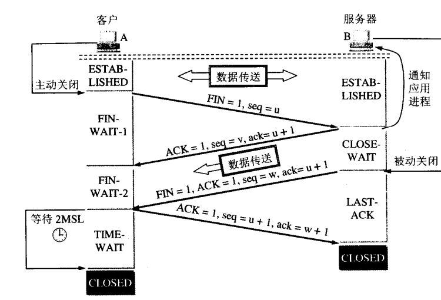
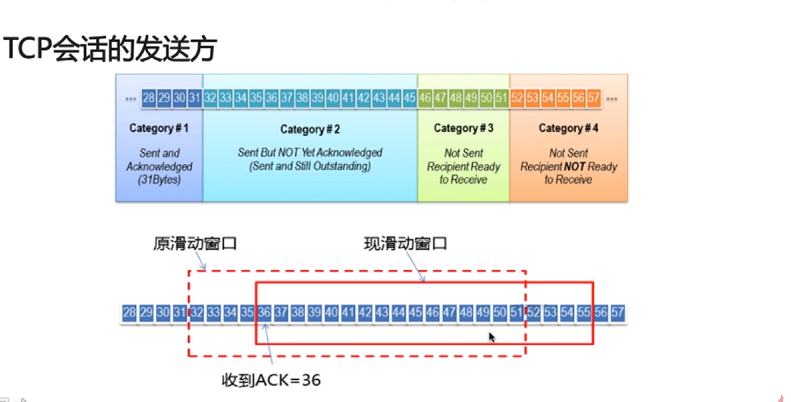
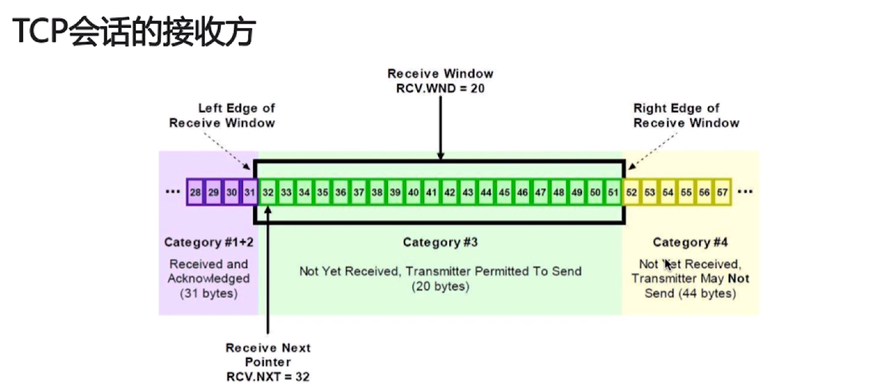
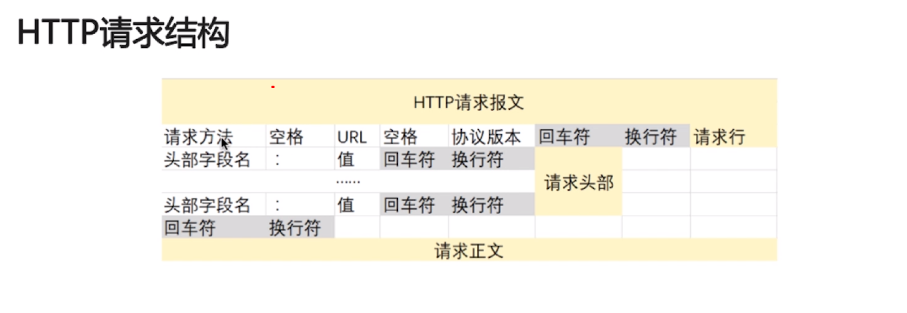

* [网络基础知识](#网络基础知识)
    * [OSI七层模型](#OSI七层模型)
    * [TCP/IP模型](#TCP/IP模型)
    * [TCP的三次握手](#TCP的三次握手)
    * [TCP的四次挥手](#TCP的四次挥手)
    * [UDP](#UDP)
    * [TCP的滑动窗口](#TCP的滑动窗口)
    * [HTTP](#HTTP)
    * [HTTP和HTTPS的区别](#HTTP和HTTPS的区别)
    * [socket](#socket)
# 网络基础知识
## OSI七层模型
1. 物理层：用于传输比特流，定制一些网线的标准，网卡工作在这层。
2. 数据链路层：将比特流转变成逻辑传输线路，格式化数据确保传输正确性，完整性，传输单位是帧，交换机工作在这层。
3. 网络层：将网络地址翻译成对应的物理地址，控制数据的路由选择路由器属于网络层，传输单位是数据包，ip协议。
4. 传输层：接受上层数据，在必要的时候把数据进行分割，且保证数据能够到达远端，tcp和udp协议。
5. 会话层：建立和管理应用程序之间的通信，确保应用程序之间能够收发数据包
6. 表示层：解决不同系统之间通信和语法问题，对数据进行格式化。
7. 应用层：规定数据的发送方的数据格式，确保接收方能够识别数据，http协议。
## TCP/IP模型
1. 链路层：物理层和数据链路层。
2. 网络层：网络层。
3. 传输层：传输层。
4. 应用层：会话层，表示层，应用层（HTTP,FTP,SMTPDNS,TELNET...）。
## TCP的三次握手
1. 传输控制协议TCP:面向连接的，可靠的，基于字节流的传输层协议。
2. 将应用层的数据流分割成报文段然后发给目标节点TCP层。
3. 数据包有序号，对方收到则发送ACK确认，未收到重传。
4. 使用校验和来检验数据在传输过程中是否有误。
5. TCP的报文头：源端口和目的端口，seq序号，ack确认号，TCP flags，滑动窗口大小，校验和，紧急指针，TCP可选项
6. TCP flags：

标志|含义
---|:--:
ACK|确认序号标志
SYN|同步序号标志，用于建立连接过程
FIN|finish标志，用于释放连接

 

7. 三次握手:第一次握手，客户端发送SYN包到服务器，进入SYN_SEND状态，等待确认；第二次握手，服务器收到SYN包，自己发送一个SYN+ACK包，此时进入SYN_RECV状态；第三次握手，客户端收到服务器SYN+ACK包，返回一个ACK确认宝，此时握手完毕进入ESTABLISHED状态，建立连接。

 

8. 为什么需要三次握手：为了初始化sequence number的初始值
9. 首次握手的隐患--SYN超时：server收到client的SYN，回复SYN-ACK的时候未收到ACK确认，server不端重试直至超时。
10. 针对SYN Flood的防护措施：SYN队列满了后，通过tcp_syncookies参数回发SYN cookie，若为正常连接会回发SYN cookie,直接建立连接，而恶意链接不会回复。
11. 建立连接后，客户端出现故障怎么办：通过保活机制，向对方发送保活探测报文，若未收到响应，继续发送，达到尝试次数仍未收到响应，则中断连接。
## TCP的四次挥手
1. 第一次挥手，客户端项服务器发送FIN报文并进去FIN_WAIT_1状态；第二次挥手，服务器收到FIN后，发送一个ACK给客户端，确认学号为收到的+1，进入CLOSE_WAIT状态；第三次挥手，服务器发送一个FIN报文，进入到LAST_ACK状态；第四次挥手，服务器收到FIN后，客户端进入TIME_WAIT状态，接着发送一个ACK给服务器，确认序号为收到的+1，服务器进入CLOSED状态。

 

2. 为什么会有TIME_WAIT状态：确保让对方收到ACK包，避免新旧连接的混淆。
3. 为什么需要四次握手才能断开连接：因为全双工没发送方和接收方都需要FIN报文和ACK报文。
4. 服务器出现大量CLOSE_WAIT的原因：对方关闭了scoket连接，我方忙于读写，没有及时关闭连接，检查代码，特别是释放资源的代码，检查配置，特别是处理请求的线程配置

## UDP
1. 面向非连接，不需建立连接，直接传输数据
2. 不为输连接状态，支持同时向多个客户端传输相同的消息
3. 数据包报头只有8个字节，额外开销小
4. 吞吐量只受限于数据时候生成速率，传输速率以及机器性能
5. 及最大努力交付，不保证可靠交付，不需要维持复杂的连接状态表
6. 面向报文的，不对数据进行拆分和合并
7. TCP和UDP的区别：

TCP|UDP
---|:--:
面向连接|无连接
可靠性|不可靠
有序性|不具备
慢|快
重量级|轻量级

 

## TCP的滑动窗口
1. RTT:发送一个数据包到收到对应的ACK的时间
2. RTO:重传间隔时间
3. TCP使用滑动窗口做流量控制和乱序重排，保证TCP的可靠性，保证TCP的流控特性
4. 滑动窗口计算大小

 

5. TCP会话的发送方

 

6. TCP会话的接收方

 

## HTTP
1. 超文本传输协议的特点：支持客户/服务器模式，简单快速，灵活，无连接，无状态
2. HTTP请求结构

 

3. HTTP响应结构

 

4. 请求/响应的步骤：客户端连接到WEB服务器，发送HTTP请求，服务器接受请求并返回HTTP响应，释放连接TCP连接，客户端浏览器解析HTML内容。
5. 在浏览器地址栏键入TRL，按下回车之后经历的流程：DNS解析；TCP连接；发送HTTP请求；服务器处理并返回HTTP报文；浏览器解析渲染画面；连接结束。
6. HTTP状态码：

状态码|含义
---|:--:
1xx|只是信息，请求已接收，继续处理
2xx|成功，表示请求已成功接收，理解，接受
3xx|重定向，要完成更进一步的操作
4xx|客户端错误，请求有语法错误或请求无法实现
5xx|服务器端错误，服务器未能实现合法的请求

 

7. 常见状态码

状态码|含义
---|:--:
200|正常返回信息
400|客户端请求有突发错误，不能被服务器理解
401|请求未被授权，这个状态代码必须和WWW-AUTHENTICATE报头一起使用
403|服务器收到请求，但是拒绝提供服务
404|请求资源不存在
500|服务器内部错误
503|服务器当前不能处理客户端请求，一段时间后可以

 

8. GET和POST请求的区别：GET将请求信息放在URL，POST放在报文体中；GET请求符合幂等性和安全性，POST不符合；GET可以被缓存和存储，但是POST不行

9. cookie：是由服务器发给客户端的特殊信息，以文本的形式存放在客户端,客户端再次请求的时候，会把COOKIE回发，服务器收到后，会解析cookie生成与客户端相对应的内容。

10. cookie的设置以及发送过程：

 

11. session:服务器端的机制，在服务器上保存信息；解析客户端请求并操作session id，按需保存状态信息

12. session的实现方式：

 

13. cookie和session的区别：cookie数据存放在客户的浏览器上，session数据存放在服务器上；session相对于cookie更安全；若考虑减轻服务器负担，应当使用cookie。

## HTTP和HTTPS的区别
1. HTTPS:

 

2. SSL：为网络通信提供安全及数据完整性的一种安全协议；是操作系统对外的API，SSL3.0后更名为TLS，采用身份验证和数据加密保证网络听信的安全和数据的完整性

3. 加密方式：对称加密，非对称加密，哈希算法，数字签名

4. HTTPS数据传输的流程：浏览器将支持的加密算法发送给服务器；服务器选择一套浏览器支持的加密算法，以证书的形式回发浏览器；浏览器验证整数的合法性，并结合证书公钥加密信息发送给服务器，服务器使用私钥解密信息，验证哈希，加密响应消息回发浏览器；浏览器解密响应消息，并对信息进行验真，之后进行加密交互数据。

5. HTTPS和HTTP的区别：HTTPS需要CA申请证书，HTTP不需要；HTTPS密文传输，HTTP明文传输；连接方式不同，HTTPS默认443端口，HTTP默认80端口；HTTPS加密+认证+完整性保护，比HTTP安全

6. HTTPS也是可以被中间人劫持的，可以使用HSTS

## socket
1. socket:

 

2. socket通信流程：

 

3. 编写一个网路应用程序，有客户端和服务器端，客服端向服务器发送一个字符串，服务器接受并将其打印在命令行上，然后返回字符串的长度，分别用TCP和UDP来实现。[代码实现](https://github.com/joeyleee/Notes/tree/master/code/javabasic/src/socket)

 

